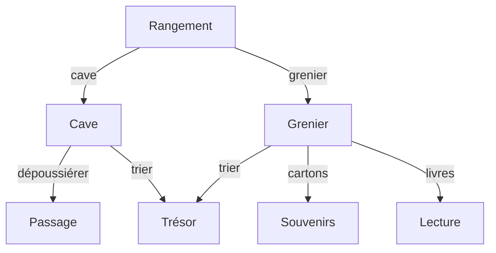

# HTML & CSS

:::note[Objectifs]

Créer un site avec HTML et CSS.

- Estimer son temps de travail

:::

## Rendu

- GitHub Classroom : https://classroom.github.com/a/iYqhqsCN
  - `./report.md` : Rapport individuel en Markdown.
- Délai : 1 semaine

## Estimation

- Estimer le temps nécessaire pour réaliser ce travail dans le rapport.
  - Découper le travail en tâches pour faciliter l'estimation.
- Une fois terminé, comparer le temps estimé avec le temps réellement passé.
- Le but n'est pas d'estimer correctement, mais de comprendre comment améliorer ses estimations.

| Tâche      | Temps estimé | Temps passé | Commentaire |
| ---------- | ------------ | ----------- | ----------- |
| Estimation | 10m          | 15m         | ...         |
| ...        | ...          | ...         | ...         |
| Total      | 2h           | 1h30        | ...         |

## GitHub Classroom

- Clonez le dépôt GitHub Classroom de cette semaine à côté de celui de la semaine précédente.
  - `git clone` depuis le répertoire du cours.

## HTML

- Créer un dossier `web-html` dans votre répertoire du dépôt Git.
- Créer un fichier `index.html` avec le contenu suivant :
  ```html title="index.html"
  <!doctype html>
  <html lang="fr">
    <head>
      <meta charset="UTF-8" />
      <meta name="viewport" content="width=device-width, initial-scale=1" />
      <title>Page Web</title>
    </head>
    <body>
      <h1>Titre de la page</h1>
      <p>Contenu de la page</p>
    </body>
  </html>
  ```
- l'arborescence du projet doit ressembler à ceci :
  ```txt {2-3}
  sem02-html-css-{pseudo}/
  └── web-html/
     └── index.html
  ```
- Ouvrir le fichier `index.html` avec **Live Server**
  - Clic droit sur le fichier `index.html` > Ouvrir avec Live Server
  - Ou cliquer sur `Go Live` en bas à droite dans Visual Studio Code
- Modifier la page Web et observer les changements
  - Modifier le titre de l'onglet (`title`)
  - Modifier le titre de la page (`h1`)
  - Modifier le contenu de la page (`p`)
- Ajouter une image à la page Web
  - Créer un dossier `images` dans le dossier `web-html`
  - Télécharger sur Internet une image dans le dossier `images`
  - Afficher l'image dans la page Web avec la balise [``](https://developer.mozilla.org/fr/docs/Learn/Getting_started_with_the_web/HTML_basics#images)
- [Baliser du texte](https://developer.mozilla.org/fr/docs/Learn/Getting_started_with_the_web/HTML_basics#baliser_du_texte)
  - Ajouter deux niveaux de titres
  - Ajouter des paragraphes
  - Créer une liste ordonnée et non ordonnée
- [Ajouter des liens](https://developer.mozilla.org/fr/docs/Learn/Getting_started_with_the_web/HTML_basics#liens)
- Formatter le fichier avec [Visual Studio Code](https://code.visualstudio.com/docs/editor/codebasics#_formatting)
  - Windows : <kbd>Alt</kbd> + <kbd>Shift</kbd> + <kbd>F</kbd>
  - macOS : <kbd>Option</kbd> + <kbd>Shift</kbd> + <kbd>F</kbd>
- Créer un commit avec le message `ajouter web-html`

## CSS

- Créer un dossier `web-css` dans le répertoire du dépôt Git.
  ```txt {2}
  sem02-html-css-{pseudo}/
  ├── web-css/
  └── web-html/
  ```
- [Démarrer avec CSS](https://developer.mozilla.org/fr/docs/Learn/CSS/First_steps/Getting_started)
- Créer un commit avec le message `ajouter web-css`
- Créer un dossier `test-css` dans le répertoire du dépôt Git.
  ```txt {2}
  sem02-html-css-{pseudo}/
  ├── test-css/
  ├── web-css/
  └── web-html/
  ```
- [Mettre en oeuvre vos connaissances](https://developer.mozilla.org/fr/docs/Learn/CSS/First_steps/Styling_a_biography_page)
- Créer un commit avec le message `ajouter test-css`.
- Ne pas oublier de pousser les commits sur le dépôt Git distant.

## Aventure

Le but est de créer un jeu d'aventure en HTML et CSS : à chaque étape, le joueur doit choisir entre plusieurs options qui le mèneront à une autre étape.

Une histoire peut être résumée par un organigramme tel que :



### HTML

- Créer un dossier `web-aventure` dans le répertoire du dépôt Git.
  ```txt {2}
  sem02-html-css-{pseudo}/
  ├── test-css/
  ├── web-aventure/
  ├── web-css/
  └── web-html/
  ```
- Créer un fichier `index.html` dans le dossier `web-aventure` :
  ```html title="index.html" showLineNumbers
  <!doctype html>
  <html lang="fr">
    <head>
      <meta charset="UTF-8" />
      <meta name="viewport" content="width=device-width, initial-scale=1.0" />
      <title>Aventure</title>
    </head>
    <body>
      <h1>Rangement</h1>
      <p>
        Vous décidez de faire du rangement dans votre maison. Par où commencer ?
      </p>
      <ul>
        <li>Cave</li>
        <li>Grenier</li>
      </ul>
    </body>
  </html>
  ```
- Créer un fichier `cave.html` dans le dossier `web-aventure` :
  ```html title="cave.html" showLineNumbers
  <!doctype html>
  <html lang="fr">
    <head>
      <meta charset="UTF-8" />
      <meta name="viewport" content="width=device-width, initial-scale=1.0" />
      <title>Aventure</title>
    </head>
    <body>
      <h1>Cave</h1>
      <p>Vous êtes à la cave. Que voulez-vous faire ?</p>
      <ul>
        <li>Dépoussiérer</li>
        <li>Trier les affaires</li>
      </ul>
    </body>
  </html>
  ```
- Lorsqu'on clique sur la cave dans `index.html`, on aimerait être redirigé vers `cave.html` :
  ```html title="index.html"
  <li><a href="cave.html">Cave</a></li>
  ```
- De manière similaire, lorsqu'on choisit de dépoussiérer la cave, on aimerait être redirigé vers `passage.html` dont le contenu est :
  ```html title="passage.html"
  <!doctype html>
  <html lang="fr">
    <head>
      <meta charset="UTF-8" />
      <meta name="viewport" content="width=device-width, initial-scale=1.0" />
      <title>Aventure</title>
    </head>
    <body>
      <h1>Passage</h1>
      <p>
        En dépoussiérant, vous découvrez une petite trappe. En l'ouvrant, vous
        trouvez un passage secret qui vous mènera vers d'autres aventures...
      </p>
    </body>
  </html>
  ```
- Créer les fichiers `tresor.html`, `grenier.html`, `souvenirs.html` et `lecture.html` avec les contenus suivants :
  - `tresor.html` :
    - Vous tombez sur un coffre rempli de pièces d'or. Faites en bon usage !
  - `grenier.html` :
    - Vous êtes dans le grenier. Que voulez-vous faire ?
      - Trier les affaires
      - Trier les cartons
      - Trier les livres
  - `souvenirs.html` :
    - Vous retrouvez plein de souvenirs d'enfance !
  - `lecture.html` :
    - Vous vous plongez dans la lecture d'un vieux livre.
- À ce stade, le jeu doit être [jouable](https://blueur.github.io/web/aventure-html/) et l'arborescence du projet doit ressembler à ceci :
  ```txt
  sem02-html-css-{pseudo}/
  └── web-aventure/
      ├── cave.html
      ├── grenier.html
      ├── index.html
      ├── lecture.html
      ├── souvenirs.html
      └── tresor.html
  ```

### CSS

- Créer un fichier `styles.css` dans le dossier `web-aventure` :
  ```css title="styles.css"
  body {
    background-color: #fdf6e3;
    color: #657b83;
  }
  p {
    font-size: 20px;
  }
  ```
- Appliquer le style à tous les fichiers HTML en ajoutant la ligne suivante dans le `head` :
  ```html
  <link rel="stylesheet" href="styles.css" />
  ```
- Appliquer les changements suivants dans le style (rechercher avec un moteur de recherche comment faire) :
  - Couleur du titre : #268bd2 (bleu)
  - Couleur des liens : #dc322f (rouge)
  - Taille de police des liens : 18 pixels
  - Couleur des liens au survol : #6c71c4 (violet)
  - Enlever le soulignement des liens
  - Changer le symbole de la liste à puce en carré
  - Changer la police de caractères de toute la page ([indice](https://www.w3schools.com/cssref/css_websafe_fonts.php))
