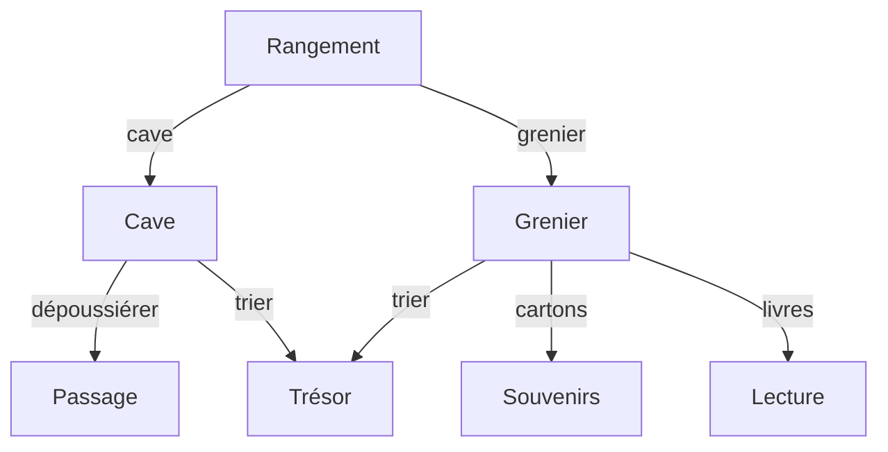

# Aventure

:::note[Objectifs]

Créer un jeu en HTML/CSS.

- Estimer son temps de travail

:::

## Rendu

- GitHub Classroom : https://classroom.github.com/a/q-aDHIeh
  - `./report.md` : Rapport individuel en Markdown.
- Délai : 1 semaine

## Estimation

- Estimer le temps nécessaire pour réaliser ce travail.
  - Découper le travail en tâches pour faciliter l'estimation.
- Une fois terminé, comparer le temps estimé avec le temps réellement passé.

| Tâche      | Temps estimé | Temps passé | Commentaire |
| ---------- | ------------ | ----------- | ----------- |
| Estimation | 10m          | 15m         | ...         |
| ...        | ...          | ...         | ...         |
| Total      | 2h           | 1h30        | ...         |

## Mise en place

- Créer un dossier `exemple` dans le répertoire du dépôt Git.
  ```txt {2}
  sem03-aventure-{pseudo}/
  └── exemple/
  ```
- Ouvrir le répertoire du dépôt Git dans Visual Studio Code.

## Aventure

Le but est de créer un jeu d'aventure en HTML et CSS : à chaque étape, le joueur doit choisir entre plusieurs options qui le mèneront à une autre étape.

Une histoire peut être résumée par un organigramme tel que :



### HTML

- Créer un fichier `index.html` dans le dossier `web-aventure` :
  ```html title="index.html" showLineNumbers
  <!doctype html>
  <html lang="fr">
    <head>
      <meta charset="UTF-8" />
      <meta name="viewport" content="width=device-width, initial-scale=1.0" />
      <title>Aventure</title>
    </head>
    <body>
      <h1>Rangement</h1>
      <p>
        Vous décidez de faire du rangement dans votre maison. Par où commencer ?
      </p>
      <ul>
        <li>Cave</li>
        <li>Grenier</li>
      </ul>
    </body>
  </html>
  ```
- Créer un fichier `cave.html` dans le dossier `web-aventure` :
  ```html title="cave.html" showLineNumbers
  <!doctype html>
  <html lang="fr">
    <head>
      <meta charset="UTF-8" />
      <meta name="viewport" content="width=device-width, initial-scale=1.0" />
      <title>Aventure</title>
    </head>
    <body>
      <h1>Cave</h1>
      <p>Vous êtes à la cave. Que voulez-vous faire ?</p>
      <ul>
        <li>Dépoussiérer</li>
        <li>Trier les affaires</li>
      </ul>
    </body>
  </html>
  ```
- Lorsqu'on clique sur la cave dans `index.html`, on aimerait être redirigé vers `cave.html` :
  ```html title="index.html"
  <li><a href="cave.html">Cave</a></li>
  ```
- De manière similaire, lorsqu'on choisit de dépoussiérer la cave, on aimerait être redirigé vers `passage.html` dont le contenu est :
  ```html title="passage.html"
  <!doctype html>
  <html lang="fr">
    <head>
      <meta charset="UTF-8" />
      <meta name="viewport" content="width=device-width, initial-scale=1.0" />
      <title>Aventure</title>
    </head>
    <body>
      <h1>Passage</h1>
      <p>
        En dépoussiérant, vous découvrez une petite trappe. En l'ouvrant, vous
        trouvez un passage secret qui vous mènera vers d'autres aventures...
      </p>
    </body>
  </html>
  ```
- Créer les fichiers `tresor.html`, `grenier.html`, `souvenirs.html` et `lecture.html` avec les contenus suivants :
  - `tresor.html` :
    - Vous tombez sur un coffre rempli de pièces d'or. Faites en bon usage !
  - `grenier.html` :
    - Vous êtes dans le grenier. Que voulez-vous faire ?
      - Trier les affaires
      - Trier les cartons
      - Trier les livres
  - `souvenirs.html` :
    - Vous retrouvez plein de souvenirs d'enfance !
  - `lecture.html` :
    - Vous vous plongez dans la lecture d'un vieux livre.

### CSS

- Créer un fichier `styles.css` dans le dossier `web-aventure` :
  ```css title="styles.css"
  body {
    background-color: #fdf6e3;
    color: #657b83;
  }
  p {
    font-size: 20px;
  }
  ```
- Appliquer le style à tous les fichiers HTML en ajoutant la ligne suivante dans le `head` :
  ```html
  <link rel="stylesheet" href="styles.css" />
  ```
- Appliquer les changements suivants dans le style (rechercher avec un moteur de recherche comment faire) :
  - Couleur du titre : #268bd2 (bleu)
  - Couleur des liens : #dc322f (rouge)
  - Taille de police des liens : 18 pixels
  - Couleur des liens au survol : #6c71c4 (violet)
  - Enlever le soulignement des liens
  - Changer le symbole de la liste à puce en carré
  - Changer la police de caractères de toute la page ([indice](https://www.w3schools.com/cssref/css_websafe_fonts.php))

### Votre aventure

- Commencer par dessiner l'organigramme de votre aventure avec environ 7 étapes.
- Créer un dossier `projet` dans le répertoire du dépôt.
  ```txt {3}
  sem03-aventure-{pseudo}/
  ├── exemple/
  └── projet/
  ```
- Créer les fichiers HTML et CSS nécessaires pour votre aventure.
