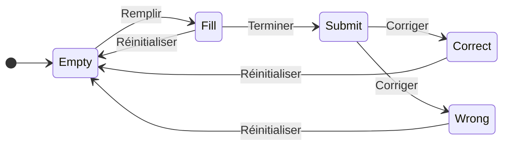

import Tabs from '@theme/Tabs';
import TabItem from '@theme/TabItem';

# 07 Projet

:::note[Objectifs]

Faire un projet avec Vue.js.

:::

## Rendu

- GitHub Classroom : https://classroom.github.com/a/0bPUTptp
  - `./report.md` : Rapport individuel en Markdown.
- Rendu le 26 décembre 2024 à 23h59.

## Journal de bord

- Écrire un journal de bord dans le fichier `report.md`.
  - La mise en forme est libre, structurez-le afin de s'y retrouver facilement chaque semaine.
- Éléments obligatoires qui doit figurer pour chaque semaine :
  - Temps estimé et temps passé sur le projet.
  - Tâches réalisées.
  - Difficultés rencontrées et solutions trouvées.
  - Explications et réflexions sur le code (Il y aura quelques questions pour vous guider chaque semaine).
  - Suite du projet (Que pourrait-on faire pour la suite du projet ?).

## Semaine 1

### Vue.js

- Cloner le nouveau dépôt Git dans le répertoire du cours.
- Ouvrir le répertoire du dépôt Git dans Visual Studio Code.
  - Installer l'extension [Vue - Official](https://marketplace.visualstudio.com/items?itemName=Vue.volar).
- Créer le fichier `report.md`.
- Créer un projet Vue.js depuis le répertoire du dépôt : `npm create vue@latest`
  - Project name: `quiz`
  - Add TypeScript? `Yes`
  - Add JSX Support? `No`
  - Add Vue Router for Single Page Application development? `Yes`
  - Add Pinia for state management? `No`
  - Add Vitest for Unit Testing? `No`
  - Add an End-to-End Testing Solution? `No`
  - Add ESLint for code quality? `Yes`
  - Add Prettier for code formatting? `Yes`
  - Add Vue DevTools 7 extension for debugging? (experimental) `Yes`
- Vérifier où se trouve le projet :
  ```txt
  sem07-project-{pseudo}
  ├── .git
  ├── .github
  ├── quiz
      └── ...
  ├── README.md
  └── report.md
  ```
- Copier tous les fichiers du projet Vue.js (dossier `quiz`) dans le répertoire du dépôt Git (dossier `sem07-project-{pseudo}`) en écrasant les fichiers existants et supprimer le dossier `quiz` :
  ```txt
  sem07-project-{pseudo}
  ├── .git
  ├── .github
  ├── .vscode
  ├── public
  ├── src
  ├── .editorconfig
  ├── .gitignore
  ├── .prettierrc.json
  ├── env.d.ts
  ├── eslint.config.js
  ├── index.html
  ├── package.json
  ├── README.md
  ├── report.md
  ├── tsconfig.app.json
  ├── tsconfig.json
  ├── tsconfig.node.json
  └── vite.config.ts
  ```
- Installer les dépendances et formater le code :
  ```sh
  npm install
  npm run format
  ```
- Pour lancer le projet en mode développement :
  ```sh
  npm run dev
  ```
  - Ouvrir le navigateur à l'adresse indiquée pour voir le projet.

### Bootstrap

- Installer Bootstrap et Bootstrap Icons :
  ```sh
  npm install bootstrap @popperjs/core bootstrap-icons
  ```
- Changer la langue et le titre de l'application en modifiant `index.html` :
  ```html
  <!doctype html>
  <html lang="fr">
    <head>
      ...
      <title>Quiz</title>
    </head>
    ...
  </html>
  ```
- Dans `eslint.config.js`, remplacer `pluginVue.configs['flat/essential']` par `pluginVue.configs['flat/recommended']`.
- Supprimer tous les fichiers dans `src/components` et dans `src/assets`.
- Créer ou modifier les fichiers suivants :

<Tabs>
<TabItem value="main.ts">

```ts title="src/main.ts" showLineNumbers
import "bootstrap-icons/font/bootstrap-icons.min.css";
import "bootstrap/dist/css/bootstrap.min.css";
import "./assets/main.css";

import "bootstrap";
import { createApp } from "vue";
import App from "./App.vue";
import router from "./router";

const app = createApp(App);

app.use(router);

app.mount("#app");
```

</TabItem>
<TabItem value="App.vue">

```html title="src/App.vue" showLineNumbers
<script setup lang="ts">
  import { RouterLink, RouterView } from "vue-router";
</script>

<template>
  <nav class="navbar navbar-expand-lg bg-body-tertiary">
    <div class="container-fluid">
      <RouterLink class="navbar-brand" to="/">
        <i class="bi bi-question-square"></i>
        Quiz
      </RouterLink>
      <button
        class="navbar-toggler"
        type="button"
        data-bs-toggle="collapse"
        data-bs-target="#navbar"
        aria-controls="navbar"
        aria-expanded="false"
        aria-label="Toggle navigation"
      >
        <span class="navbar-toggler-icon"></span>
      </button>
      <div id="navbar" class="collapse navbar-collapse">
        <ul class="navbar-nav">
          <li class="nav-item">
            <RouterLink class="nav-link" to="/about">
              <i class="bi bi-info-square"></i>
              À propos
            </RouterLink>
          </li>
        </ul>
      </div>
    </div>
  </nav>
  <RouterView />
</template>
```

</TabItem>
<TabItem value="main.css">

```css title="src/assets/main.css" showLineNumbers
/* https://getbootstrap.com/docs/5.3/components/buttons/#variables */
.btn-primary {
  --bs-btn-color: #fff;
  --bs-btn-bg: #0d6efd;
  --bs-btn-border-color: #0d6efd;
  --bs-btn-hover-color: #fff;
  --bs-btn-hover-bg: #0b5ed7;
  --bs-btn-hover-border-color: #0a58ca;
  --bs-btn-focus-shadow-rgb: 49, 132, 253;
  --bs-btn-active-color: #fff;
  --bs-btn-active-bg: #0a58ca;
  --bs-btn-active-border-color: #0a53be;
  --bs-btn-active-shadow: inset 0 3px 5px rgba(0, 0, 0, 0.125);
  --bs-btn-disabled-color: #fff;
  --bs-btn-disabled-bg: #0d6efd;
  --bs-btn-disabled-border-color: #0d6efd;
}
```

</TabItem>
<TabItem value="AboutView.vue">

```html title="src/views/AboutView.vue" showLineNumbers
<template>
  <div class="container mt-3">
    <h1>À propos</h1>
    <p>
      Lorem ipsum dolor sit amet, consectetur adipiscing elit. Sed do eiusmod
      tempor incididunt ut labore et dolore magna aliqua. Ut enim ad minim
      veniam, quis nostrud exercitation ullamco laboris nisi ut aliquip ex ea
      commodo consequat. Duis aute irure dolor in reprehenderit in voluptate
      velit esse cillum dolore eu fugiat nulla pariatur. Excepteur sint occaecat
      cupidatat non proident, sunt in culpa qui officia deserunt mollit anim id
      est laborum.
    </p>
  </div>
</template>
```

</TabItem>
<TabItem value="HomeView.vue">

```html title="src/views/HomeView.vue" showLineNumbers
<script setup lang="ts">
  import QuizForm from "@/components/QuizForm.vue";
</script>

<template>
  <div class="container mt-3">
    <h1>Quiz</h1>
    <QuizForm />
  </div>
</template>
```

</TabItem>
<TabItem value="QuizForm.vue">

```html title="src/components/QuizForm.vue" showLineNumbers
<script setup lang="ts">
  import { computed, ref } from "vue";

  const cheval = ref<string | null>(null);
  const filled = computed<boolean>(() => cheval.value !== null);

  function submit(event: Event): void {
    event.preventDefault();
    if (filled.value) {
      alert(`Vous avez choisi la couleur ${cheval.value} !`);
    }
  }
</script>

<template>
  <form>
    De quelle couleur est le cheval blanc de Napoléon ?
    <div class="form-check">
      <input
        id="chevalBlanc"
        v-model="cheval"
        class="form-check-input"
        type="radio"
        name="cheval"
        value="blanc"
      />
      <label class="form-check-label" for="chevalBlanc">Blanc</label>
    </div>
    <div class="form-check">
      <input
        id="chevalBrun"
        v-model="cheval"
        class="form-check-input"
        type="radio"
        name="cheval"
        value="brun"
      />
      <label class="form-check-label" for="chevalBrun">Brun</label>
    </div>
    <div class="form-check">
      <input
        id="chevalNoir"
        v-model="cheval"
        class="form-check-input"
        type="radio"
        name="cheval"
        value="noir"
      />
      <label class="form-check-label" for="chevalNoir">Noir</label>
    </div>
    <button
      class="btn btn-primary"
      :class="{ disabled: !filled }"
      @click="submit"
    >
      Terminer
    </button>
  </form>
</template>
```

</TabItem>
</Tabs>

- Vérifier que l'application fonctionne correctement.
  - Voici le [code source](https://github.com/blueur/quiz/tree/week/1-init) et le [site web final](https://blueur.github.io/quiz/).
- Ne pas oublier de faire régulièrement des commits à chaque fois qu'on a un état stable du projet (code fonctionnel, comme ici).

### Quiz

- Modifier le quiz pour qu'il y ait deux-trois questions à choix multiples. Voici quelques idées :
  - De quelle couleur est le cheval blanc de Napoléon ?
  - Combien de pattes a un chat ?
  - Quelle est la capitale de la Suisse ?
- Proposer quatre réponses possibles pour chaque question.
- Afficher le score à la fin du quiz (mettre la logique du calcul dans la fonction `submit`, juste après le `event.preventDefault();`).
- Afficher un message de félicitations si le score est parfait.
- Ajouter un bouton pour réinitialiser le quiz.
  - Ajouter un bouton dans `QuizForm.vue` :
    ```html
    <button class="btn btn-secondary" @click="reset">Réinitialiser</button>
    ```
  - Votre bouton va appeler une fonction `reset` qu'il faudra créer.
- Modifier la couleur des `.btn-primary` dans `main.css`.
- Changer les icônes dans la bar de navigation (en haut) en utilisant [Bootstrap Icons](https://icons.getbootstrap.com/).

:::info[Question rapport]

- Répondre aux questions suivantes dans le rapport :
  - Expliquer le rôle des fichiers suivants :
    - `main.ts`
    - `main.css`
    - `App.vue`
    - `router/index.ts`
    - `AboutView.vue`
    - `HomeView.vue`
    - `QuizForm.vue`
  - Dans le fichier `QuizForm.vue` :
    - Quelles sont les similarités et les différences entre `ref` et `computed` ?
    - Que se passe-t-il lorsqu'on clique sur le bouton "Terminer" ?
    - Qu'est-ce qu'un `v-model` ?
    - À quoi sert le `:class="{ disabled: !filled }"` ?

:::

:::tip[Exemple]

https://github.com/blueur/quiz/tree/week/1-final

:::

## Semaine 2

### QuestionRadio

C'est fastidieux de devoir répéter les mêmes étapes pour chaque question. On va donc créer un composant pour les questions : `QuestionRadio.vue`.

Commencer par définir comment on voudrait que le composant fonctionne. On pourrait vouloir remplacer chaque question par un composant `QuestionRadio` :

```html title="src/components/QuizForm.vue"
<template>
  <form>
    <QuestionRadio
      id="cheval"
      v-model="cheval"
      text="De quelle couleur est le cheval blanc de Napoléon ?"
      :options="[
        { value: 'blanc', text: 'Blanc' },
        { value: 'brun', text: 'Brun' },
        { value: 'noir', text: 'Noir' },
      ]"
    />
    ...
  </form>
</template>
```

- Le composant `QuestionRadio` doit recevoir les propriétés suivantes :
  - `v-model` : la valeur de la réponse (bi-directionnel, car on veut pouvoir modifier la réponse depuis le composant parent lorsqu'on clique sur le bouton "Réinitialiser" et récupérer la réponse depuis le composant parent pour calculer le score).
  - `id` : un identifiant unique pour le groupe de boutons radio.
  - `text` : le texte de la question.
  - `options` : un tableau d'objets pour les options de réponse. Chaque objet doit avoir une propriété `value` pour la valeur de la réponse et une propriété `text` pour le texte affiché de l'option.
- Ne pas oublier d'importer le nouveau composant dans `QuizForm.vue` :
  ```html
  <script setup lang="ts">
    import QuestionRadio from "@/components/QuestionRadio.vue";
    ...
  </script>
  ```

Créer le fichier `QuestionRadio.vue` dans le dossier `src/components` :

```html title="src/components/QuestionRadio.vue" showLineNumbers
<script setup lang="ts">
  import { defineModel, defineProps, type PropType } from "vue";

  const model = defineModel<string | null>();
  const props = defineProps({
    id: { type: String, required: true },
    text: { type: String, required: true },
    options: {
      type: Array as PropType<Array<{ value: string; text: string }>>,
      required: true,
    },
  });
</script>

<template>
  {{ props.text }}
  <div v-for="option in props.options" :key="option.value" class="form-check">
    <input
      :id="`${props.id}-${option.value}`"
      v-model="model"
      class="form-check-input"
      type="radio"
      :name="props.id"
      :value="option.value"
    />
    <label class="form-check-label" :for="`${props.id}-${option.value}`">
      {{ option.text }}
    </label>
  </div>
</template>
```

- Dans la partie `<script>`, on utilise les fonctions `defineModel` et `defineProps` pour définir le modèle (`v-model`) et les propriétés (`text`, `name`, `options`) du composant.
- Dans la partie `<template>` :
  - On affiche le texte de la question : `{{ props.text }}`.
  - On affiche les options de réponse en utilisant une boucle `v-for` sur `props.options` : le `<div>` sera répété pour chaque option.
  - La différence entre les attributs qui commencent par `:` et ceux qui ne commencent pas par `:` est que les premiers sont des expressions JavaScript (interprétées) et les seconds sont des chaînes de caractères (non interprétées).

:::info[Question rapport]

Quelle est la différence entre un prop et un modèle (`v-model`) ?

:::

### QuestionText

De manière similaire, créer un composant `QuestionText.vue` pour les questions à réponse textuelle libre. Voici un code qu'on voudrait extraire dans le composant `QuestionText.vue` :

```html title="src/components/QuizForm.vue"
<label for="exampleFormControlInput" class="form-label">
  Combien de pattes a un chat ?
</label>
<input
  id="exampleFormControlInput"
  v-model="reponse"
  class="form-control"
  placeholder="Veuillez saisir un nombre"
/>
```

Et on souhaiterait l'utiliser comme ceci dans `QuizForm.vue` :

```html title="src/components/QuizForm.vue"
<QuestionText
  id="chat"
  v-model="reponse"
  text="Combien de pattes a un chat ?"
  placeholder="Veuillez saisir un nombre"
/>
```

:::info[Question rapport]

Comment rendre la propriété `placeholder` optionnelle ?

:::

Documentation : [Vue.js](https://fr.vuejs.org/guide/essentials/forms#text) + [Bootstrap](https://getbootstrap.com/docs/5.3/forms/form-control/).

### API

[Open Trivia Database](https://opentdb.com/) est une API qui fournit des questions de quiz. On va utiliser cette API pour obtenir des questions aléatoires pour notre quiz :

En naviguant sur le site, on peut voir qu'on peut obtenir des questions en faisant une requête HTTP GET à l'URL suivante : https://opentdb.com/api.php?amount=10&type=multiple

- `amount` : le nombre de questions à obtenir.
- `type` : le type de questions (multiple ou boolean).

Ajouter une nouvelle tab `Trivia` dans `App.vue` :

```html title="src/App.vue"
...
<ul class="navbar-nav">
  <li class="nav-item">
    <RouterLink class="nav-link" to="/trivia">
      <i class="bi bi-question"></i>
      Trivia
    </RouterLink>
  </li>
  ...
</ul>
...
```

Créer une nouvelle vue `TriviaView.vue` dans le dossier `src/views` :

```html title="src/views/TriviaView.vue"
<script setup lang="ts">
  import QuizTrivia from "@/components/QuizTrivia.vue";
</script>

<template>
  <div class="container mt-3">
    <h1>Trivia</h1>
    <QuizTrivia />
    Source :
    <a href="https://opentdb.com/" target="_blank">Open Trivia Database</a>
  </div>
</template>
```

Mettre à jour le fichier `router/index.ts` en ajoutant une nouvelle route :

```ts title="src/router/index.ts"
...
const router = createRouter({
  history: createWebHistory(import.meta.env.BASE_URL),
  routes: [
    ...
    {
      path: '/trivia',
      name: 'trivia',
      component: () => import('../views/TriviaView.vue'),
    },
  ]
...
```

Finalement ajouter le composant `QuizTrivia.vue` dans le dossier `src/components` :

```html title="src/components/QuizTrivia.vue"
<script setup lang="ts">
  import QuestionRadio from "@/components/QuestionRadio.vue";
  import { reactive, ref } from "vue";

  const questions = ref<
    {
      question: string;
      correct_answer: string;
      incorrect_answers: string[];
    }[]
  >([]);
  const answers = reactive<{ [key: number]: string | null }>({});

  fetch("https://opentdb.com/api.php?amount=10&type=multiple")
    .then((response) => response.json())
    .then((data) => (questions.value = data.results));
</script>

<template>
  <form>
    <QuestionRadio
      v-for="(question, index) in questions"
      :id="index.toString()"
      :key="index"
      v-model="answers[index]"
      :text="question.question"
      :options="[
        { value: question.correct_answer, text: question.correct_answer },
        ...question.incorrect_answers.map(answer => ({
          value: answer,
          text: answer,
        })),
      ]"
    />
  </form>
</template>
```

À sa création, ce composant va récupérer 10 questions avec l'API (https://opentdb.com/api.php?amount=10&type=multiple) et stocker les questions dans la `ref` `questions`. Ensuite, on affiche chaque question avec le composant `QuestionRadio` (avec une boucle `v-for`) en passant les propriétés nécessaires.

### QuestionCheckbox (bonus)

Les checkboxes sont comme les radios, mais on peut en sélectionner plusieurs. Créer un composant `QuestionCheckbox.vue` pour les questions à choix multiples. Voici un exemple d'utilisation :

```html title="src/components/QuizForm.vue"
<div class="form-check">
  <input
    id="checkboxJane"
    v-model="checkedNames"
    class="form-check-input"
    type="checkbox"
    value="Jane"
  />
  <label class="form-check-label" for="checkboxJane">Jane</label>
</div>
<div class="form-check">
  <input
    id="checkboxJohn"
    v-model="checkedNames"
    class="form-check-input"
    type="checkbox"
    value="John"
  />
  <label class="form-check-label" for="checkboxJohn">John</label>
</div>
```

Noter que comme la réponse est une liste, il faut initialiser la `ref` avec une liste vide :

```js
const checkedNames = ref<string[]>([]);
```

Documentation : [Vue.js](https://fr.vuejs.org/guide/essentials/forms#checkbox) + [Bootstrap](https://getbootstrap.com/docs/5.3/forms/checks-radios/#checks).

:::tip[Exemple]

https://github.com/blueur/quiz/tree/week/2-final

:::

## Semaine 3

### Réponse

On voudrait incorporer la vérification de la réponse dans chaque composant de question car elle est spécifique à chaque type de question.

Modifier la partie `script` de `QuestionRadio.vue` :

- Modifier la propriété `v-model` pour qu'elle soit de type `boolean`.
  - Chaque question va juste indiquer si la réponse de l'utilisateur est correcte ou non.
- Ajouter une nouvelle propriété `answer` qui contient la réponse correcte.
- Ajouter une nouvelle `ref` `value` pour stocker la réponse de l'utilisateur.
- Ajouter un `watch` sur `value` qui permet d'exécuter une fonction à chaque fois que `value` change ([Documentation](https://fr.vuejs.org/guide/essentials/watchers)).
  - Cette fonction prend en paramètre la nouvelle valeur de `value`.
  - Elle va comparer la réponse de l'utilisateur avec la réponse correcte et mettre à jour le modèle `model` en conséquence.
- Dans le template, modifier le `v-model` des inputs pour qu'il soit lié à `value`.

```html title="src/components/QuestionRadio.vue"
<script setup lang="ts">
  import { ref, watch, type PropType } from "vue";

  const model = defineModel<boolean>();
  const props = defineProps({
    id: { type: String, required: true },
    text: { type: String, required: true },
    answer: { type: String, required: true },
    options: {
      type: Array as PropType<Array<{ value: string; text: string }>>,
      required: true,
    },
  });

  const value = ref<string | null>(null);

  watch(
    value,
    (newValue) => {
      model.value = newValue === props.answer;
    },
    { immediate: true },
  );
</script>

<template>
  {{ props.text }}
  <div v-for="option in props.options" :key="option.value" class="form-check">
    <input
      :id="`${props.id}-${option.value}`"
      v-model="value"
      ...
```

Dans `QuizForm.vue`, ajouter une nouvelle `ref` `correctAnswers` pour stocker l'exactitude de chaque réponse :

- Modifier la propriété `v-model` de chaque `QuestionRadio` pour qu'elle soit un élément de la liste `correctAnswers`.
- Ajouter l'attribut `answer` à chaque `QuestionRadio` pour indiquer la réponse correcte.
- Ajouter une nouvelle `div` pour afficher la valeur de `correctAnswers`.

```html title="src/components/QuizForm.vue"
<script setup lang="ts">
  ...
  const correctAnswers = ref<boolean[]>([])
  ...
</script>

<template>
  <form>
    <QuestionRadio v-model="correctAnswers[0]" answer="blanc" ... />
    ...
    <div>Réponses correctes : {{ correctAnswers }}</div>
  </form>
</template>
```

Tester votre application :

- Les valeurs de `correctAnswers` doivent être `true` si la réponse de l'utilisateur est correcte et `false` sinon.
- Les valeurs de `correctAnswers` doivent être mises à jour à chaque fois que l'utilisateur change sa réponse.

:::info[Question rapport]

À quoi sert l'option `immediate: true` dans le `watch` ? Que se passe-t-il si on l'enlève ou si on met `immediate: false` ?

:::

Mettre à jour le composant `QuestionText.vue` de manière similaire à `QuestionRadio.vue`.

### Score

Dans `QuizForm.vue`, le calcul du score se fera désormais selon les valeurs de `correctAnswers` :

- Ajouter une nouvelle `computed` `score` qui calcule le score en fonction des valeurs de `correctAnswers` ([Documentation](https://fr.vuejs.org/guide/essentials/computed.html)).
  - `correctAnswers.value` est un tableau de booléens.
  - La méthode `filter` retourne un nouveau tableau avec les éléments qui satisfassent la condition ([Exemple](https://rxjs.dev/api/operators/filter#description)).
  - Ici, on ne va garder que les éléments qui sont `true` (réponses correctes).
  - La propriété `length` retourne la taille du nouveau tableau qui ne contient que des `true`.
  - On a donc compté le nombre de `true` dans `correctAnswers.value`.
- Ajouter une nouvelle `computed` `totalScore` qui calcule le score maximal possible.
- Ajouter une nouvelle `div` pour afficher le score actuel et le score maximal possible.

```html title="src/components/QuizForm.vue"
<script setup lang="ts">
  ...
  const score = computed<number>(() => correctAnswers.value.filter((value) => value).length);
  const totalScore = ... // à compléter
  ...
</script>

<template>
  <form>
    ...
    <div>Score : {{ score }} / {{ totalScore }}</div>
  </form>
</template>
```

Nettoyer le code en enlevant les parties qui ne sont plus nécessaires (l'ancienne logique de calcul du score).

:::info[Question rapport]

Proposer une autre manière de calculer le score (réécrire la fonction du computed) et comparer les deux méthodes.

:::

Le calcul du score se fait maintenant en temps réel : à chaque fois que l'utilisateur change sa réponse, le score est mis à jour automatiquement.

La logique des boutons "Terminer" et "Réinitialiser" sera revue la prochaine semaine.

:::tip[Exemple]

https://github.com/blueur/quiz/tree/week/3-final

:::

## Semaine 4

### États

Il n'est pas idéal que les questions soient corrigées en temps réel. Chaque question peut donc avoir plusieurs états :

- `Empty` : la question n'a pas été répondue.
- `Fill` : la question a été répondue.
- `Submit` : la question a été soumise pour correction.
- `Correct` : la réponse est juste.
- `Wrong` : la réponse est fausse.



Créer un nouveau fichier `src/utils/models.ts` :

```ts title="src/utils/models.ts"
export enum QuestionState {
  Empty = "Empty",
  Fill = "Fill",
  Submit = "Submit",
  Correct = "Correct",
  Wrong = "Wrong",
}
```

- Un [enum (type énuméré)](https://fr.wikipedia.org/wiki/Type_%C3%A9num%C3%A9r%C3%A9) est un type qui peut prendre une valeur parmi un ensemble de valeurs pré-définies.
- On crée un enum `QuestionState` qui contient les états possibles pour une question.
- `export` permet d'importer cet enum dans d'autres fichiers.

Le modèle de chaque question va donc contenir un état au lieu d'un booléen :

```ts title="src/components/QuestionRadio.vue"
...
import { QuestionState } from '@/utils/models'
...
const model = defineModel<QuestionState>()
...
```

Ajouter un nouveau `watch` sur `model` pour corriger la question si l'état est `Submit` :

- Si l'état est `Submit`, il deviendra `Correct` si la réponse est juste et `Wrong` sinon.

```ts title="src/components/QuestionRadio.vue"
...
watch(
  model,
  (newModel) => {
    if (newModel === QuestionState.Submit) {
      model.value = value.value === props.answer ? QuestionState.Correct : QuestionState.Wrong
    }
  },
);
...
```

:::info[Question rapport]

Comment pourrait-on réécrire la ligne suivante sans l'opérateur ternaire (avec des `if` et `else`) ?

```ts
model.value =
  value.value === props.answer ? QuestionState.Correct : QuestionState.Wrong;
```

:::

Adapter le `watch` sur `value` pour qu'il mette à jour le modèle (`Empty` ou `Fill`) :

- Si la valeur devient `null`, l'état devient `Empty`.
- Sinon, l'état devient `Fill`.

```ts title="src/components/QuestionRadio.vue"
...
watch(
  value,
  (newValue) => {
    if (newValue === null) {
      model.value = QuestionState.Empty
    } else {
      model.value = QuestionState.Fill
    }
  },
  { immediate: true },
);
...
```

:::info[Question rapport]

Comment pourrait-on réécrire autrement la logique du `watch` sur `value` ?

:::

Adapter `QuestionText.vue` de manière similaire à `QuestionRadio.vue`.

Dans `QuizForm.vue`, on va stocker l'état de chaque question :

- Renommer `correctAnswers` en `questionStates`.
- Changer le type de `questionStates` pour qu'il soit un tableau de `QuestionState`.
- Adapter le calcul du score (compter le nombre de `Correct` dans `questionStates`).

```ts title="src/components/QuizForm.vue"
...
const questionStates = ref<QuestionState[]>([])
const score = computed<number>(
  () =>
    questionStates.value
      .filter(state => state === QuestionState.Correct)
      .length,
)
const totalScore = computed<number>(() => questionStates.value.length)
...
```

Afin de plus facilement debug l'application, ajouter une nouvelle `div` pour afficher les états de chaque question :

```html title="src/components/QuizForm.vue"
<template>
  <form>
    ...
    <div>Debug états : {{ questionStates }}</div>
  </form>
</template>
```

L'application devrait être fonctionnelle et les états des questions devraient être correctement mis à jour.

### Boutons

Le bouton "Terminer" nous permet de soumettre toutes les réponses pour correction. Adapter la fonction `submit` dans `QuizForm.vue` :

- `questionStates` va devenir une liste avec que des `Submit`.
- `map` permet d'appliquer une fonction à chaque élément d'un tableau ([Documentation](https://rxjs.dev/api/operators/map)). Ici, la fonction retourne `QuestionState.Submit` pour chaque élément.

```ts title="src/components/QuizForm.vue"
...
function submit(event: Event): void {
  event.preventDefault()
  questionStates.value = questionStates.value.map(() => QuestionState.Submit)
}
...
```

De manière similaire, adapter la fonction `reset` pour mettre tous les états à `Empty` :

<details>
<summary>Solution</summary>

```ts title="src/components/QuizForm.vue"
...
function reset(event: Event): void {
  event.preventDefault()
  questionStates.value = questionStates.value.map(() => QuestionState.Empty)
}
...
```

</details>

Pour que le `reset` fonctionne, il faut aussi adapter le `watch` sur `model` dans `QuestionRadio.vue` et `QuestionText.vue` :

- Si l'état est `Empty`, `value` doit redevenir `null`.

<details>
<summary>Solution</summary>

```ts title="src/components/QuestionRadio.vue et src/components/QuestionText.vue"
...
watch(
  model,
  (newModel) => {
    if (newModel === QuestionState.Submit) {
      model.value = value.value === props.answer ? QuestionState.Correct : QuestionState.Wrong
    } else if (newModel === QuestionState.Empty) {
      value.value = null
    }
  },
);
...
```

</details>

De retour sur `QuizForm`, adapter `filled` pour qu'il vérifie si toutes les questions sont dans l'état `Fill` :

- `every` retourne `true` si toutes les valeurs du tableau satisfont la condition ([Documentation](https://rxjs.dev/api/operators/every)).

```ts title="src/components/QuizForm.vue"
...
const filled = computed<boolean>(() => questionStates.value.every(state => state === QuestionState.Fill))
...
```

Afficher le score uniquement si toutes les questions ont été soumises et corrigées :

```html title="src/components/QuizForm.vue"
<template>
  <form>
    ...
    <div v-if="submitted">Score : {{ score }} / {{ totalScore }}</div>
  </form>
</template>
```

Définir `submitted` (de manière similaire à `filled`) : vérifier si tous les états sont `Correct` ou `Wrong`.

<details>
<summary>Solution</summary>

```ts title="src/components/QuizForm.vue"
...
const submitted = computed<boolean>(() => questionStates.value.every(state => state === QuestionState.Correct || state === QuestionState.Wrong))
...
```

</details>

### Réponses immuables

Rendre les réponses immuables (non modifiables) après avoir soumis le quiz :

- Dans `QuestionRadio.vue` et `QuestionText.vue`, les `input` doivent être `disabled` si l'état est `Submit`, `Correct` ou `Wrong`.

```html title="src/components/QuestionRadio.vue et src/components/QuestionText.vue"
<template>
  ...
  <input
    ...
    :disabled="
      model === QuestionState.Submit || 
      model === QuestionState.Correct || 
      model === QuestionState.Wrong
    "
  />
  ...
</template>
```

:::tip[Exemple]

https://github.com/blueur/quiz/tree/week/4-final

:::

## Semaine 5

:::tip[Exemple]

https://github.com/blueur/quiz/tree/week/5-final

:::

## Semaine 6

Voici quelques idées pour améliorer le projet :

- `QuestionCheckbox.vue` : Sélectionner plusieurs réponses.
- `QuestionSelect.vue` : Sélectionner une réponse dans une liste déroulante.

## Aides

### Documentations

Aidez-vous des documentations officielles pour réaliser le projet :

- [Vue.js](https://fr.vuejs.org/guide/introduction)
- [Bootstrap](https://getbootstrap.com/docs/5.3/getting-started/introduction/)
- [Bootstrap Icons](https://icons.getbootstrap.com/)

Exemple final : https://blueur.github.io/quiz/

### Vérification

Pour vérifier que le code est correct localement, on peut construire le projet :

```sh
npm run build
```

### Exemple

- [Semaine 1](https://github.com/blueur/quiz/tree/week/1-final)
- [Semaine 2](https://github.com/blueur/quiz/tree/week/2-final)
- [Semaine 3](https://github.com/blueur/quiz/tree/week/3-final)
- [Semaine 4](https://github.com/blueur/quiz/tree/week/4-final)
- [Semaine 5](https://github.com/blueur/quiz/tree/week/5-final)
- [Résultat final](https://blueur.github.io/quiz/)

## Évaluation

L'évaluation du projet se portera sur les critères suivants :

- Rapport
  - [ ] **Le journal de bord est à jour et complet.**
  - [ ] _Le journal de bord est bien structuré et synthétique._
- Fonctionnalités
  - [ ] **L'application a les mêmes fonctionnalités que l'exemple.**
  - [ ] **L'application est personnalisée.**
  - [ ] _Bootstrap est correctement utilisé pour rendre l'application responsive._
  - [ ] _L'application a plus de fonctionnalités que l'exemple._
- Code
  - [ ] **Le code suit les conventions de codage (formatage, nommage, organisation, &hellip;).**
  - [ ] **Le code est lisible et maintenable (nommage, commentaires, &hellip;).**
  - [ ] _Le code est bien structuré (composants, design pattern, &hellip;)._

|            Note            | &nbsp;1&nbsp; | &nbsp;2&nbsp; | 2.5 | &nbsp;3&nbsp; | 3.5 | &nbsp;4&nbsp; | 4.5 | &nbsp;5&nbsp; | 5.5 | &nbsp;6&nbsp; |
| :------------------------: | :-----------: | :-----------: | :-: | :-----------: | :-: | :-----------: | :-: | :-----------: | :-: | :-----------: |
| Nombre de critères validés |       0       |       1       |  2  |       3       |  4  |       5       |  6  |       7       |  8  |       9       |

- **En gras** : critères principaux.
- _En italique_ : critères secondaires.
