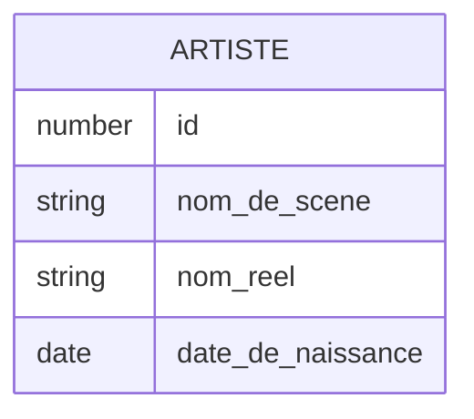
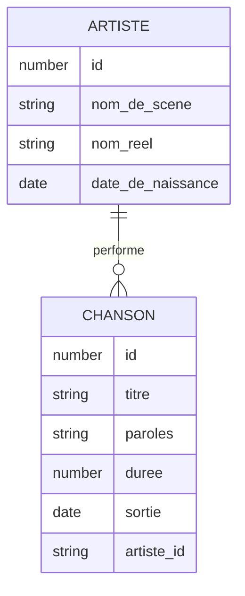

# Base de données

Programmation Web et bases de données

---

## Base de données

- Base de données (BD) - Database (DB)
- &shy;<!-- .element: class="fragment" --> Donnée ?
  - &shy;<!-- .element: class="fragment" --> Une information
- &shy;<!-- .element: class="fragment" --> Base de données ?
  - &shy;<!-- .element: class="fragment" --> Un ensemble organisé de données
- &shy;<!-- .element: class="fragment" --> Exemples :
  - Carnet d'adresses
  - Annuaire téléphonique
  - Bibliothèque
  - ...

---

## SGBD

- Système de gestion de base de données (SGBD) - Database Management System (DBMS)
- &shy;<!-- .element: class="fragment" --> **Logiciel** permettant de stocker, manipuler et interroger des données
- &shy;<!-- .element: class="fragment" --> Exemples :
  - MySQL
  - PostgreSQL
  - SQLite
  - MongoDB
  - ...

---

## Architecture Ansi/Sparc

 <!-- .element: class="full" -->

  <a href="https://commons.wikimedia.org/wiki/File:ANSI-SPARC_DB_model.jpg">​Wikipedia user X00022027</a>, <a href="http://creativecommons.org/licenses/by-sa/3.0/">CC BY-SA 3.0</a>, via Wikimedia Commons

---

## Architecture Ansi/Sparc

| Niveau     | Utilisé par                  | Description                                       |
| ---------- | ---------------------------- | ------------------------------------------------- |
| Externe    | Programmeur·euse applicatif  | Vue partielle de la DB (selon les droits d'accès) |
| Conceptuel | DBA (Database administrator) | Vue complète de la DB                             |
| Interne    | Programmeur·euse du DBMS     | Comment est stockée l'information (fichiers)      |

- &shy;<!-- .element: class="fragment" --> Une même base de donnée peut être mutualisée par plusieurs applications.
  - &shy;<!-- .element: class="fragment" --> Chaque application peut avoir une vue différente de la base de données.

---

## Modèle entité-association

- Entity–relationship model (ER model)
- &shy;<!-- .element: class="fragment" --> Une **représentation** graphique d'une base de données relationnelle (**modélisation** conceptuelle)

 <!-- .element: class="full-width fragment" -->

  <a href="https://commons.wikimedia.org/wiki/File:MCD-Relation-Example.svg">Qwertyuu</a>, <a href="https://creativecommons.org/licenses/by-sa/4.0">CC BY-SA 4.0</a>, via Wikimedia Commons

---

### Entité

- &shy;<!-- .element: class="fragment" --> **Entité** : ARTISTE
  - &shy;<!-- .element: class="fragment" --> Qui/Quoi ?
- &shy;<!-- .element: class="fragment" --> **Attributs** : nom_de_scene, nom_reel, date_de_naissance
  - &shy;<!-- .element: class="fragment" --> Quelles sont ses propriétés/caractéristiques ?
- &shy;<!-- .element: class="fragment" --> **Clé primaire** : id
  - &shy;<!-- .element: class="fragment" --> Comment l'identifier de manière unique ?
- &shy;<!-- .element: class="fragment" --> Exemples :
  - 32, "Phanee de Pool", "Fanny Diercksen", 1984-06-06
  - 42, "Cécile Corbel", "Cécile Corbel", 1980-03-28

---

### Association

---

### Résumé

- _Entité_
  - &shy;<!-- .element: class="fragment" --> **Objet** du monde réel (table)
- _Association_
  - &shy;<!-- .element: class="fragment" --> **Relation** entre les entités (clé étrangère)
- _Attribut_
  - &shy;<!-- .element: class="fragment" --> **Propriété** d'une entité (colonne)
- _Clé primaire_
  - &shy;<!-- .element: class="fragment" --> Attribut **unique** identifiant un élément de l'entité
- _Clé étrangère_
  - &shy;<!-- .element: class="fragment" --> Attribut faisant **référence** à une clé primaire d'une autre entité
