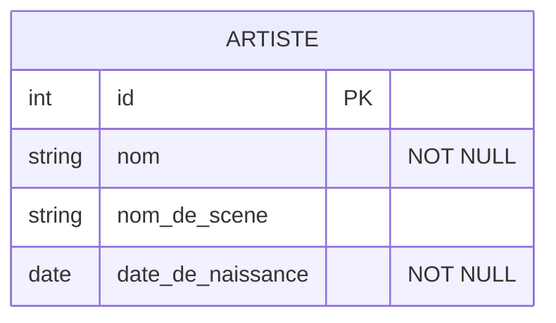
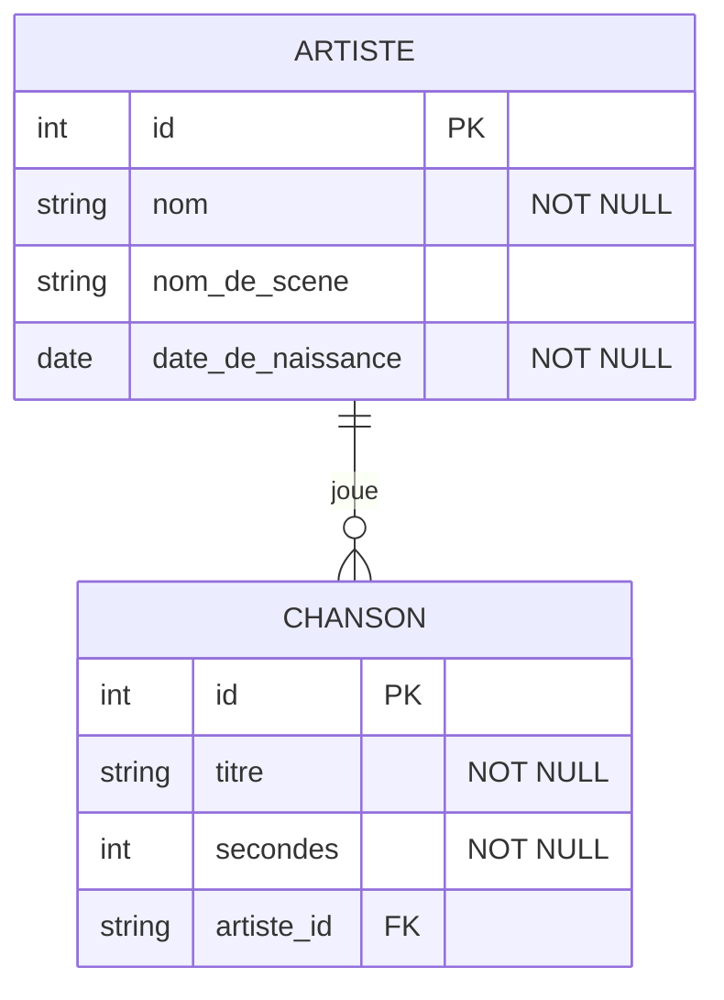

# Base de données

Programmation Web et bases de données

---

## Base de données

- Base de données (BD) - Database (**DB**)
- &shy;<!-- .element: class="fragment" --> Donnée ?
  - &shy;<!-- .element: class="fragment" --> Une **information**
- &shy;<!-- .element: class="fragment" --> Base de données ?
  - &shy;<!-- .element: class="fragment" --> Un ensemble **organisé** de données
- &shy;<!-- .element: class="fragment" --> Exemples :
  - Carnet d'adresses
  - Annuaire téléphonique
  - Bibliothèque
  - ...

---

## SGBD

- Système de gestion de base de données (SGBD) - Database Management System (**DBMS**)
- &shy;<!-- .element: class="fragment" --> **Logiciel** permettant de stocker, manipuler et interroger des données
- &shy;<!-- .element: class="fragment" --> Exemples :
  - MySQL
  - PostgreSQL
  - SQLite
  - MongoDB
  - ...

---

## Architecture Ansi/Sparc

 <!-- .element: class="full" -->

  <a href="https://commons.wikimedia.org/wiki/File:ANSI-SPARC_DB_model.jpg">​Wikipedia user X00022027</a>, <a href="http://creativecommons.org/licenses/by-sa/3.0/">CC BY-SA 3.0</a>, via Wikimedia Commons

---

## Architecture Ansi/Sparc

| Niveau     | Utilisé par                  | Description                                       |
| ---------- | ---------------------------- | ------------------------------------------------- |
| Externe    | Programmeur·euse applicatif  | Vue partielle de la DB (selon les droits d'accès) |
| Conceptuel | DBA (Database administrator) | Vue complète de la DB                             |
| Interne    | Programmeur·euse du DBMS     | Comment est stockée l'information (fichiers)      |

- &shy;<!-- .element: class="fragment" --> Une même base de donnée peut être mutualisée par plusieurs applications.
  - &shy;<!-- .element: class="fragment" --> Chaque application peut avoir une vue différente de la base de données.

---

## Modèle entité-association

- Entity–relationship model (ER model)
- &shy;<!-- .element: class="fragment" --> Une **représentation** graphique d'une base de données relationnelle (**modélisation** conceptuelle)

 <!-- .element: class="full-width fragment" -->

  <a href="https://commons.wikimedia.org/wiki/File:MCD-Relation-Example.svg">Qwertyuu</a>, <a href="https://creativecommons.org/licenses/by-sa/4.0">CC BY-SA 4.0</a>, via Wikimedia Commons

---

### Entité

---

### Entité

- _Entité_ : ARTISTE
  - Qui/Quoi ?
- &shy;<!-- .element: class="fragment" --> _Attributs_ : nom, nom_de_scene, date_de_naissance
  - Quelles sont ses propriétés/caractéristiques ?
  - **NOT NULL** : attribut obligatoire
- &shy;<!-- .element: class="fragment" --> _Clé primaire_ (Primary key, _PK_) : id
  - Comment l'identifier de manière unique ?
- &shy;<!-- .element: class="fragment" --> Exemples :
  | id | nom | nom_de_scene | date_de_naissance |
  | :-: | ---------------- | ----------------- | ----------------- |
  | 1 | "Phanee de Pool" | "Fanny Diercksen" | 1984-06-06 |
  | 2 | "Cécile Corbel" | | 1980-03-28 |

---

### Limitation(s) ?

- &shy;<!-- .element: class="fragment" --> Nom réel inconnu ? (ex. Daft Punk)
- &shy;<!-- .element: class="fragment" --> Date de naissance inconnue ?

---

### Association

---

### Association

 <!-- .element: class="full" -->

https://www.lucidchart.com/pages/ER-diagram-symbols-and-meaning <!-- .element: class="reference" -->

---

#### One-to-Many

Exemple : ARTISTE joue CHANSON

- &shy;<!-- .element: class="fragment" --> **Relation** entre les entités ARTISTE et CHANSON
  - Chaque ARTIST peut jouer **plusieurs** CHANSON
  - Chaque CHANSON est jouée par **un seul** ARTISTE
- &shy;<!-- .element: class="fragment" --> **Clé étrangère** (Foreign key, **FK**) : artiste_id
  - &shy;<!-- .element: class="fragment" --> **Référence** à la clé primaire de l'entité ARTISTE
- &shy;<!-- .element: class="fragment" --> CHANSON
  | id | titre | secondes | artiste_id |
  | :-: | ---------------------- | -------- | ---------- |
  | 1 | "Arrietty's Song" | 206 | 2 |
  | 2 | "The Neglected Garden" | 253 | 2 |
  | 3 | "Algorithme" | 232 | 1 |
- &shy;<!-- .element: class="fragment" --> Zero-or-One-to-Many
  - &shy;<!-- .element: class="fragment" --> Un artiste peut ne pas avoir de chanson

---

#### Many-to-Many

Si plusieurs artistes jouent la même chanson ?

- &shy;<!-- .element: class="fragment" --> Chaque ARTISTE peut jouer **plusieurs** CHANSON
- &shy;<!-- .element: class="fragment" --> Chaque CHANSON peut être jouée par **plusieurs** ARTISTE
- &shy;<!-- .element: class="fragment" --> Utilisation d'un **table de liaison** (ou table de jointure)
  - One-to-Many entre ARTISTE et la table de liaison ARTISTE_CHANSON
  - One-to-Many entre CHANSON et la table de liaison ARTISTE_CHANSON
  - La table de liaison est composée de deux **clés** étrangères

 <!-- .element: class="fragment" -->

https://sqlmodel.tiangolo.com/tutorial/many-to-many/create-models-with-link/ <!-- .element: class="reference" -->

---

#### One-to-One

Exemple : PAYS a CAPITALE

- &shy;<!-- .element: class="fragment" --> **Relation** entre les entités PAYS et CAPITALE
  - Chaque PAYS a **une seule** CAPITALE
  - Chaque CAPITALE est la capitale d'**un seul** PAYS
- &shy;<!-- .element: class="fragment" --> Peut être **fusionné** en une seule entité : PAYS
  | id | nom | capitale |
  | :-: | ---------------- | ---------- |
  | 1 | "Suisse" | "Berne" |
  | 2 | "France" | "Paris" |
- &shy;<!-- .element: class="fragment" --> **Clé étrangère** unique dans une des deux entités : CAPITALE
  | id | nom | pays_id |
  | :-: | ---------------- | -------- |
  | 42 | "Berne" | 1 |
  | 16 | "Paris" | 2 |

---

### Résumé

- _Entité_
  - &shy;<!-- .element: class="fragment" --> **Objet** du monde réel (table)
- _Association_
  - &shy;<!-- .element: class="fragment" --> **Relation** entre les entités (clé étrangère)
- _Attribut_
  - &shy;<!-- .element: class="fragment" --> **Propriété** d'une entité (colonne)
  - &shy;<!-- .element: class="fragment" --> **NOT NULL** : attribut obligatoire
- _Clé primaire_ (PK)
  - &shy;<!-- .element: class="fragment" --> Attribut **unique** identifiant un élément de l'entité
- _Clé étrangère_ (FK)
  - &shy;<!-- .element: class="fragment" --> Attribut faisant **référence** à une clé primaire d'une autre entité
