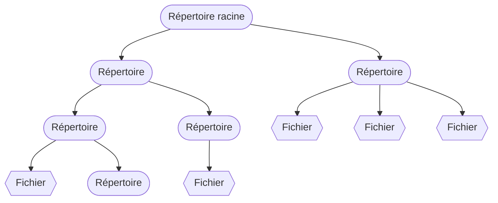
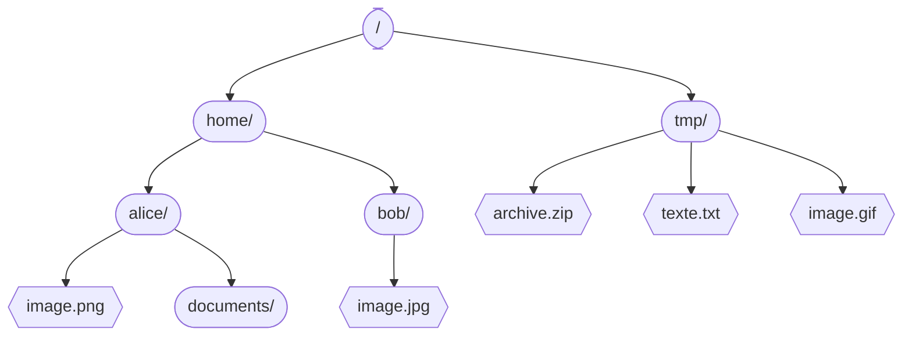
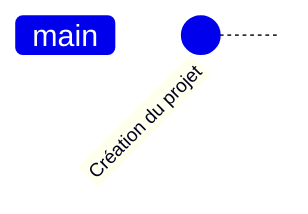
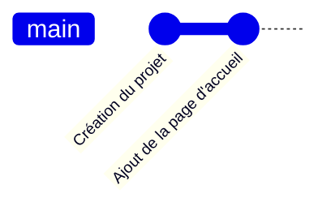
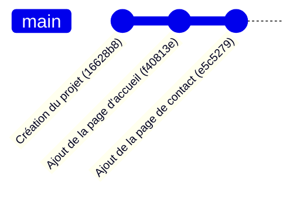
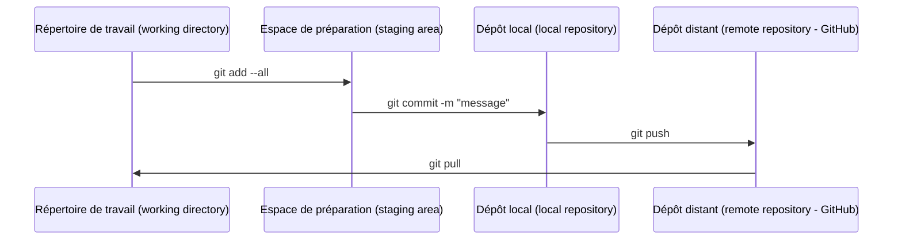

# Environnement

Programmation Web et bases de données

---

## Système de fichiers

- &shy;<!-- .element: class="fragment" --> **Arborescence** de répertoires (dossiers) et de fichiers
- &shy;<!-- .element: class="fragment" --> Un répertoire peut contenir des **fichiers** et d'autres **répertoires**
- &shy;<!-- .element: class="fragment" --> Répertoire **racine** : `/`

---

### Chemin absolu

- &shy;<!-- .element: class="fragment" --> **Chemin absolu** d'un fichier ou d'un répertoire
  - &shy;<!-- .element: class="fragment" --> `/home/alice/image.png`
  - &shy;<!-- .element: class="fragment" --> `/home/bob/`
  - &shy;<!-- .element: class="fragment" --> **Identification** unique

---

### Chemin relatif

- **Répertoire de travail (courant)** (working directory)
- &shy;<!-- .element: class="fragment" --> **Chemin relatif** : par rapport au **répertoire courant** (/home/alice/)
  - &shy;<!-- .element: class="fragment" --> `./documents/` (`.` : répertoire courant) ou `documents/`
  - &shy;<!-- .element: class="fragment" --> `../bob/image.jpg` (`..` : répertoire parent)
  - &shy;<!-- .element: class="fragment" --> `../../tmp/texte.txt`

---

## GUI vs CLI

- &shy;<!-- .element: class="fragment" --> Interfaces pour **interagir** avec l'ordinateur
- &shy;<!-- .element: class="fragment" --> Graphical User Interface (**GUI**)
  - &shy;<!-- .element: class="fragment" --> Quoi ? **Souris** et **clavier**
  - &shy;<!-- .element: class="fragment" --> Comment ? **Clics** et **déplacements**
  - &shy;<!-- .element: class="fragment" --> Où ? **Explorateur de fichiers**
- &shy;<!-- .element: class="fragment" --> Command Line Interface (**CLI**)
  - &shy;<!-- .element: class="fragment" --> Quoi ? **Clavier** uniquement
  - &shy;<!-- .element: class="fragment" --> Comment ? **Commandes** textuelles
  - &shy;<!-- .element: class="fragment" --> Où ? **Terminal**

---

## Terminal

 <!-- .element: class="full" -->

&shy;<!-- .element: class="reference" --> https://wiki-tech.io/Linux/D%C3%A9butant/Terminal

---

## Terminal

- &shy;<!-- .element: class="fragment" --> **Programme** permettant d'exécuter des **commandes**
- &shy;<!-- .element: class="fragment" --> Commandes possibles:
  - &shy;<!-- .element: class="fragment" --> **Naviguer** dans les répertoires : `cd`
  - &shy;<!-- .element: class="fragment" --> **Créer** et **supprimer** des fichiers et répertoires : `touch`, `mkdir`, `rm`
  - &shy;<!-- .element: class="fragment" --> **Copier** et **déplacer** des fichiers : `cp`, `mv`
  - &shy;<!-- .element: class="fragment" --> **Installer** des logiciels : `apt`, `brew`, `choco`
  - &shy;<!-- .element: class="fragment" --> **Exécuter** des programmes : `node`, `python`
- &shy;<!-- .element: class="fragment" --> **Shell** : programme qui **interprète** les commandes
  - &shy;<!-- .element: class="fragment" --> Exemples: **bash**, **zsh**, **PowerShell**, **cmd**

---

## IDE

- &shy;<!-- .element: class="fragment" --> **I**ntegrated **D**evelopment **E**nvironment (Environnement de développement intégré)
- &shy;<!-- .element: class="fragment" --> **Éditeur de texte** avec des fonctionnalités supplémentaires
- &shy;<!-- .element: class="fragment" --> Facilite l'**édition** et le **débogage** du code
- &shy;<!-- .element: class="fragment" --> Exemples populaires:
  - &shy;<!-- .element: class="fragment" --> [Visual Studio Code](https://code.visualstudio.com/) ou [VSCodium](https://vscodium.com/)
    - **Open source** et **gratuit**
  - &shy;<!-- .element: class="fragment" --> [IntelliJ IDEA](https://www.jetbrains.com/idea/) ou autres IDE de [JetBrains](https://www.jetbrains.com/)
    - **Payant** (sauf étudiant), mais meilleur **refactoring** et **autocomplétion**
  - &shy;<!-- .element: class="fragment" --> [Eclipse](https://www.eclipse.org/)
    - **Open source** et **gratuit**, mais **lourd**
- &shy;<!-- .element: class="fragment" --> **Jupyter** ?
  - &shy;<!-- .element: class="fragment" --> Pour des **rapports** interactifs **&ne;** développement de **logiciels**

---

## Logiciel de gestion de versions

- &shy;<!-- .element: class="fragment" --> Version control system (**VCS**)
- &shy;<!-- .element: class="fragment" --> **Conserve** le code source avec son **historique**
- &shy;<!-- .element: class="fragment" --> Permet de **collaborer** à plusieurs sur le même code
- &shy;<!-- .element: class="fragment" --> Le plus populaire: **Git**

---

### Historique des modifications

---

### Historique des modifications

---

### Historique des modifications

---

## Git

- &shy;<!-- .element: class="fragment" --> Les modifications sont stockées dans des **commits**
- &shy;<!-- .element: class="fragment" --> Chaque commit est **identifié** par un **hash**
- &shy;<!-- .element: class="fragment" --> Chaque commit a un **parent**
  - Différence avec le commit précédent (parent)
- &shy;<!-- .element: class="fragment" --> Les **branches** et **tags** sont des **pointeurs** vers un commit
  - Les **branches** sont des pointeurs **mobiles**
  - Les **tags** sont des pointeurs **fixes**

---

### Dépôts (repository) locaux et distants

&shy;<!-- .element: class="reference" --> https://medium.com/@allema_s/git-expliqu%C3%A9-a-mes-coll%C3%A8gues-de-boulot-823875d737fa

---

### Commandes Git

