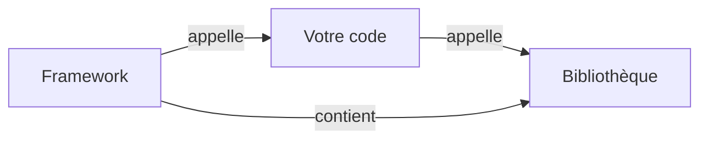

# Framework

Programmation Web et bases de données

---

## Bibliothèque

- **Bibliothèque** : **library** en anglais (souvent mal traduit en librairie)
- &shy;<!-- .element: class="fragment" --> Comment éviter de réinventer la roue ?
  - &shy;<!-- .element: class="fragment" --> **Réutiliser** du code existant
  - &shy;<!-- .element: class="fragment" --> Ensemble de **fonctions**/méthodes
  - &shy;<!-- .element: class="fragment" --> Python :
    - &shy;<!-- .element: class="fragment" --> [The Python Standard Library](https://docs.python.org/3/library/)
      - **import** `math`, `os`, `random`, `re`, `sys`, `time`, etc.
    - &shy;<!-- .element: class="fragment" --> [PyPI](https://pypi.org/)
      - **pip install** `requests`, `pytest`, `flask`, etc.
      - **import** `requests`, `pytest`, `flask`, etc.

---

## Framework

- **Framework** : peut être traduit par **cadre de travail**
- &shy;<!-- .element: class="fragment" --> Comment structurer un projet ?
  - &shy;<!-- .element: class="fragment" --> **Organiser** le code et les fichiers
    - Structure de **fichiers**
    - **Conventions** de nommage
- &shy;<!-- .element: class="fragment" --> Applique un/des **patron(s) de conception**
  - Domaine de l'**architecture** logicielle
- &shy;<!-- .element: class="fragment" --> Quelques exemples :
  - **Django** (Python)
  - **Vue.js** (JavaScript)
  - **Spring** (Java)
  - **Express** (Node.js)
  - **Ruby on Rails** (Ruby)

---

### Patron de conception (design pattern)

- Aussi appelés **modèles de conception**
- &shy;<!-- .element: class="fragment" --> Meilleure **Solution** connue à un problème récurrent
  - &shy;<!-- .element: class="fragment" --> Réutilisation de **bonnes pratiques**
  - &shy;<!-- .element: class="fragment" --> **Abstraction** des concepts
  - &shy;<!-- .element: class="fragment" --> Facilite la **communication** entre développeurs
- &shy;<!-- .element: class="fragment" --> Exemples :
  - **Itérateur**
  - Modèle-Vue-Contrôleur (**MVC**)

---

#### Itérateur

- &shy;<!-- .element: class="fragment" --> Problème : Comment **parcourir** une **collection** d'objets ?
- &shy;<!-- .element: class="fragment" --> Solution : Accéder aux éléments **individuellement** sans exposer la structure interne
- &shy;<!-- .element: class="fragment" --> Exemple :
  - avec itérateur
    ```python
    for element in collection:
        print(element) # accès à l'élément courant
    ```
  - sans itérateur
    ```python
    for i in range(len(collection)):
        print(collection[i]) # accès à la collection
    ```

---

#### Itérateur


- &shy;<!-- .element: class="fragment" --> Dans quel ordre **visiter** une ville ?
- &shy;<!-- .element: class="fragment" --> **Itérateurs** : guide audio, guide papier, guide touristique, etc.
  - &shy;<!-- .element: class="fragment" --> **Abstraction** de l'itinéraire

https://refactoring.guru/fr/design-patterns/iterator <!-- .element: class="reference" -->

---

#### Modèle-Vue-Contrôleur (MVC)

- &shy;<!-- .element: class="fragment" --> Problème : Comment **gérer** les **interactions** avec une application ?
- &shy;<!-- .element: class="fragment" --> Solution : **Séparer** les **responsabilités**
  - **Modèle** : gestion des **données** et de la **logique**
  - **Vue** : **affichage** des données
  - **Contrôleur** : gestion des **actions** de l'utilisateur

 <!-- .element: class="fragment" -->

<p class="reference">
  <a href="https://commons.wikimedia.org/wiki/File:Mod%C3%A8le-vue-contr%C3%B4leur_(MVC)_-_fr.png">Benoît Prieur</a>, CC0, via Wikimedia Commons
</p>

---

### Bibliothèque vs Framework



---

### Framework CSS

- &shy;<!-- .element: class="fragment" --> Ensemble de **règles CSS** prédéfinies et réutilisables
- &shy;<!-- .element: class="fragment" --> **Objectif** : accélérer le développement
  - **Esthétique** : design moderne
  - **Responsive** : adapté à tous les écrans
  - **Consistant** : cohérence des éléments
- &shy;<!-- .element: class="fragment" --> Exemples :
  - **Bootstrap** (Twitter)
  - **Foundation**
  - **Bulma**
  - **Tailwind CSS**

---

## Responsive design

- &shy;<!-- .element: class="fragment" --> **Adaptation** de l'interface utilisateur
  - **Taille** : smartphone, tablette, ordinateur
  - **Orientation** : portrait, paysage
  - **Résolution** : densité de pixels

---

### Les grilles

---

### Le modèle de boîte

---

## Formateur de code
