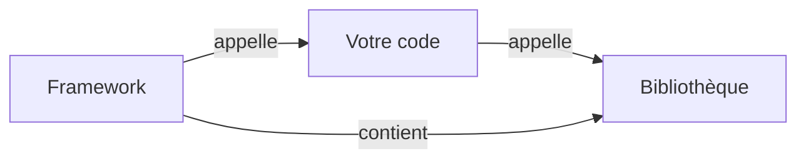

# Framework

Programmation Web et bases de données

---

## Bibliothèque

- **Bibliothèque** : **library** en anglais (souvent mal traduit en librairie)
- &shy;<!-- .element: class="fragment" --> Comment éviter de réinventer la roue ?
  - &shy;<!-- .element: class="fragment" --> **Réutiliser** du code existant
  - &shy;<!-- .element: class="fragment" --> Ensemble de **fonctions**/méthodes
  - &shy;<!-- .element: class="fragment" --> Python :
    - &shy;<!-- .element: class="fragment" --> [The Python Standard Library](https://docs.python.org/3/library/)
      - **import** `math`, `os`, `random`, `re`, `sys`, `time`, etc.
    - &shy;<!-- .element: class="fragment" --> [PyPI](https://pypi.org/)
      - **pip install** `requests`, `pytest`, `flask`, etc.
      - **import** `requests`, `pytest`, `flask`, etc.

---

## Framework

- **Framework** : peut être traduit par **cadre de travail**
- &shy;<!-- .element: class="fragment" --> Comment structurer un projet ?
  - &shy;<!-- .element: class="fragment" --> **Organiser** le code et les fichiers
    - Structure de **fichiers**
    - **Conventions** de nommage
- &shy;<!-- .element: class="fragment" --> Applique un/des **patron(s) de conception**
  - Domaine de l'**architecture** logicielle
- &shy;<!-- .element: class="fragment" --> Quelques exemples :
  - **Django** (Python)
  - **Vue.js** (JavaScript)
  - **Spring** (Java)
  - **Express** (Node.js)
  - **Ruby on Rails** (Ruby)

---

### Patron de conception (design pattern)

- Aussi appelés **modèles de conception**
- &shy;<!-- .element: class="fragment" --> Meilleure **Solution** connue à un problème récurrent
  - &shy;<!-- .element: class="fragment" --> Réutilisation de **bonnes pratiques**
  - &shy;<!-- .element: class="fragment" --> **Abstraction** des concepts
  - &shy;<!-- .element: class="fragment" --> Facilite la **communication** entre développeurs
- &shy;<!-- .element: class="fragment" --> Exemples :
  - **Itérateur**
  - Modèle-Vue-Contrôleur (**MVC**)

---

#### Itérateur

- &shy;<!-- .element: class="fragment" --> Problème : Comment **parcourir** une **collection** d'objets ?
- &shy;<!-- .element: class="fragment" --> Solution : Accéder aux éléments **individuellement** sans exposer la structure interne
- &shy;<!-- .element: class="fragment" --> Exemple :
  - avec itérateur
    ```python
    for element in collection:
        print(element) # accès à l'élément courant
    ```
  - sans itérateur
    ```python
    for i in range(len(collection)):
        print(collection[i]) # accès à la collection
    ```

---

#### Itérateur


- &shy;<!-- .element: class="fragment" --> Dans quel ordre **visiter** une ville ?
- &shy;<!-- .element: class="fragment" --> **Itérateurs** : guide audio, guide papier, guide touristique, etc.
  - &shy;<!-- .element: class="fragment" --> **Abstraction** de l'itinéraire

https://refactoring.guru/fr/design-patterns/iterator <!-- .element: class="reference" -->

---

#### Modèle-Vue-Contrôleur (MVC)

- &shy;<!-- .element: class="fragment" --> Problème : Comment **gérer** les **interactions** avec une application ?
- &shy;<!-- .element: class="fragment" --> Solution : **Séparer** les **responsabilités**
  - **Modèle** : gestion des **données** et de la **logique**
  - **Vue** : **affichage** des données
  - **Contrôleur** : gestion des **actions** de l'utilisateur

 <!-- .element: class="fragment" -->

<p class="reference">
  <a href="https://commons.wikimedia.org/wiki/File:Mod%C3%A8le-vue-contr%C3%B4leur_(MVC)_-_fr.png">Benoît Prieur</a>, CC0, via Wikimedia Commons
</p>

---

### Bibliothèque vs Framework



---

### Framework CSS

- &shy;<!-- .element: class="fragment" --> Ensemble de **règles CSS** prédéfinies et réutilisables
- &shy;<!-- .element: class="fragment" --> Objectif : **accélérer** le développement
  - **Esthétique** : design moderne
  - **Responsive** : adapté à tous les écrans
  - **Consistant** : cohérence des éléments
- &shy;<!-- .element: class="fragment" --> Exemples :
  - **Bootstrap** (Twitter)
  - **Foundation**
  - **Bulma**
  - **Tailwind CSS**

---

## Responsive web design

 <!-- .element: class="full" -->

<p class="reference">
  <a href="https://commons.wikimedia.org/wiki/File:Content-is-like-water.svg">Stéphanie Walter</a>, <a href="https://creativecommons.org/licenses/by-sa/3.0">CC BY-SA 3.0</a>, via Wikimedia Commons
</p>

---

## Responsive web design

- Années 2000 : début de l'**adaptation** aux **écrans** (smartphones)
  - 2010 : **Responsive Web Design** (RWD) par [Ethan Marcotte](https://alistapart.com/article/responsive-web-design/)
- &shy;<!-- .element: class="fragment" --> Objectif : meilleure expérience utilisateur (**UX**)
  - **Lisibilité** et **navigation** améliorées
- &shy;<!-- .element: class="fragment" --> Trois composantes :
  - &shy;<!-- .element: class="fragment" --> **Media queries** : règles css selon la **largeur** de l'écran
    - `@media (max-width: 600px) { ... }`
  - &shy;<!-- .element: class="fragment" --> **Grille fluide** : dispositions flexibles (nombre d'éléments par ligne)
  - &shy;<!-- .element: class="fragment" --> **Images flexibles** : adaptatives (unités relatives)

---

### Viewport

- &shy;<!-- .element: class="fragment" --> **Viewport** : fenêtre visible de la page web
- &shy;<!-- .element: class="fragment" --> `<meta name="viewport" content="width=device-width, initial-scale=1" />`

|                                                                         Sans le viewport                                                                          |                                                                        Avec le viewport                                                                        |
| :---------------------------------------------------------------------------------------------------------------------------------------------------------------: | :------------------------------------------------------------------------------------------------------------------------------------------------------------: |
| [<!-- .element: style="border-style: solid;" -->](https://www.w3schools.com/html/example_withoutviewport.htm) | [<!-- .element: style="border-style: solid;" -->](https://www.w3schools.com/html/example_withviewport.htm) |

<!-- .element: class="fragment" -->

https://www.w3schools.com/html/html_responsive.asp <!-- .element: class="reference" -->

---

### Media queries

 <!-- .element: class="full" -->

https://www.interaction-design.org/literature/article/responsive-design-let-the-device-do-the-work <!-- .element: class="reference" -->

---

### Grille fluide

 <!-- .element: class="full" -->

https://www.interaction-design.org/literature/article/responsive-design-let-the-device-do-the-work <!-- .element: class="reference" -->

---

### Images flexibles

 <!-- .element: class="full-width" -->

https://www.interaction-design.org/literature/article/responsive-design-let-the-device-do-the-work <!-- .element: class="reference" -->

---

## Modèle de boîte

 <!-- .element: class="full" -->

https://www.theodinproject.com/lessons/foundations-the-box-model <!-- .element: class="reference" -->

---

## Modèle de boîte

 <!-- .element: class="full" -->

https://developer.mozilla.org/fr/docs/Learn/CSS/Building_blocks/The_box_model <!-- .element: class="reference" -->

---

## Système de grille

 <!-- .element: class="full" -->

<p class="reference">
  <a href="https://commons.wikimedia.org/wiki/File:Grid1aib.svg">GearedBull</a>, Public domain, via Wikimedia Commons
</p>

---

## Système de grille

 <!-- .element: class="full" -->

<p class="reference">
  <a href="https://commons.wikimedia.org/wiki/File:Grid2aib.svg">GearedBull</a>, Public domain, via Wikimedia Commons
</p>

---

## Système de grille


https://developer.mozilla.org/fr/docs/Web/CSS/CSS_grid_layout/Realizing_common_layouts_using_grids <!-- .element: class="reference" -->

- &shy;<!-- .element: class="fragment" --> Placer les éléments dans une grille de **12 colonnes**

---

## Système de grille


https://developer.mozilla.org/fr/docs/Web/CSS/CSS_grid_layout/Realizing_common_layouts_using_grids <!-- .element: class="reference" -->

- &shy;<!-- .element: class="fragment" --> **Adaptation** des éléments selon la **largeur** de l'écran
  - &shy;<!-- .element: class="fragment" --> Main article area :
    - **12** colonnes sur petit écran
    - **8** colonnes sur moyen et grand écrans
- &shy;<!-- .element: class="fragment" --> Les éléments passent à la **ligne** suivante **automatiquement**

---

## Système de grille

 <!-- .element: class="full" -->

https://travishorn.com/responsive-grid-in-2-minutes-with-css-grid-layout-4842a41420fe <!-- .element: class="reference" -->

---

## Formateur de code

- &shy;<!-- .element: class="fragment" --> Le formatage du code n'a pas d'**impact** sur le **résultat**
  - Améliore la **lisibilité** du code
  - Repérer les **erreurs** plus facilement
- &shy;<!-- .element: class="fragment" --> **Convention** de formatage :
  - **Indentation** de 2 ou 4 espaces
  - **Saut de ligne** à la fin du fichier
  - **Espaces** autour des opérateurs
  - Nombre de caractères **maximum** par ligne
- &shy;<!-- .element: class="fragment" --> Exemples de **formateurs** :
  - **Prettier** (HTML, CSS, JavaScript, Markdown, etc.)
  - **autopep8** (Python) : applique les règles de [PEP 8](https://peps.python.org/pep-0008/)
  - **Black** (Python) : `Black is opinionated so you don’t have to be.`
- &shy;<!-- .element: class="fragment" --> **Consensus** dans le projet pour la **cohérence**
