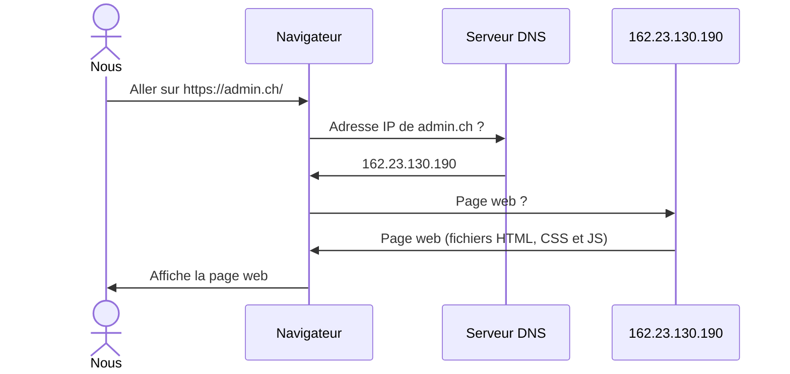

# Internet & Web

Programmation Web et bases de données

---

## Réseau & Internet

- &shy;<!-- .element: class="fragment" --> **Réseau**
  - &shy;<!-- .element: class="fragment" --> Ensemble d'ordinateurs **connectés** entre eux
- &shy;<!-- .element: class="fragment" --> **Internet**
  - &shy;<!-- .element: class="fragment" --> **Inter**connected **net**works
  - &shy;<!-- .element: class="fragment" --> **Le** réseau **mondial** et **public**
  - &shy;<!-- .element: class="fragment" --> Réseau de réseaux
  - &shy;<!-- .element: class="fragment" --> Internet **&ne;** Web
  - &shy;<!-- .element: class="fragment" --> **ARPANET** : Ancêtre d'Internet (**1969**)
  - &shy;<!-- .element: class="fragment" --> Entre les **universités** pour l'**armée** **américaine**
    - &shy;<!-- .element: class="fragment" --> Réseau **décentralisé** pour **résister** à des bombardements

---

## Adresse IP

- &shy;<!-- .element: class="fragment" --> IP = **I**nternet **P**rotocol
- &shy;<!-- .element: class="fragment" --> **Identifiant** unique d'un appareil sur un réseau
  - &shy;<!-- .element: class="fragment" --> Comme une adresse postale
- &shy;<!-- .element: class="fragment" --> [whatismyipaddress.com](https://whatismyipaddress.com/)

---

### Versions d'adresse IP

- &shy;<!-- .element: class="fragment" --> **IPv4**
  - &shy;<!-- .element: class="fragment" --> Le plus **utilisé**
  - &shy;<!-- .element: class="fragment" --> 32 bits &rarr; 2<sup>32</sup> = 4 294 967 296 adresses possibles
  - &shy;<!-- .element: class="fragment" --> Exemple : 172.16.254.1
- &shy;<!-- .element: class="fragment" --> **IPv6**
  - &shy;<!-- .element: class="fragment" --> Le plus **récent** (1998) car manque d'adresses
  - &shy;<!-- .element: class="fragment" --> 128 bits &rarr; 2<sup>128</sup> = 3.4 &times; 10<sup>38</sup> adresses possibles
  - &shy;<!-- .element: class="fragment" --> Exemple : 2001:0db8:ac10:fe01:0000:0000:0000:0000

---

#### IPv4

 <!-- .element: class="full" -->

<p class="reference">
  <a href="https://commons.wikimedia.org/wiki/File:Adresse_Ipv4.svg">Star Trek Man</a>, Public domain, via Wikimedia Commons
</p>

---

#### IPv6

 <!-- .element: class="full" -->

<p class="reference">
  <a href="https://commons.wikimedia.org/wiki/File:Ipv6_address-fr.svg">Indeterminate</a>, CC0, via Wikimedia Commons
</p>

---

### Exercice : adresses IP valides ?

- &shy;<!-- .element: class="fragment" --> 205.233.12.23
  - &shy;<!-- .element: class="fragment" --> Oui
- &shy;<!-- .element: class="fragment" --> 240.264.23.2
  - &shy;<!-- .element: class="fragment" --> Non (264 > 255)
- &shy;<!-- .element: class="fragment" --> 123.8.12.2.34
  - &shy;<!-- .element: class="fragment" --> Non (4 nombres)
- &shy;<!-- .element: class="fragment" --> 4E3F:DEA7:409B:412C:2516:4A2B:2CFE:1282
  - &shy;<!-- .element: class="fragment" --> Oui (IPv6)

---

### Adresses IP particulières

- &shy;<!-- .element: class="fragment" --> 127.0.0.1
  - &shy;<!-- .element: class="fragment" --> **localhost** (notre propre ordinateur)
  - &shy;<!-- .element: class="fragment" --> ::1 (0000:0000:0000:0000:0000:0000:0000:0001) pour IPv6
- &shy;<!-- .element: class="fragment" --> 10.x.x.x, 172.16-31.x.x, 192.168.x.x
  - &shy;<!-- .element: class="fragment" --> **Adresses privées**
  - &shy;<!-- .element: class="fragment" --> Utilisées au sein d'un réseau local/privé (école, entreprise, ...)

---

## Nom de domaine

- &shy;<!-- .element: class="fragment" --> Plus **lisible** et **facile à retenir** qu'une adresse IP
  - admin.ch &rarr; 162.23.130.190
  - office.com &rarr; 13.107.6.156
  - localhost &rarr; 127.0.0.1
- &shy;<!-- .element: class="fragment" --> **Louable** auprès d'un **registraire**
  - .ch coûte ~10.-/an
  - .com coûte ~15.-/an
  - https://www.infomaniak.com/fr/domaines

---

### Structure d'un nom de domaine

```katex
\underbrace{\text{www}}_{\text{troisième niveau}}.\underbrace{\text{exemple}}_{\text{deuxième niveau}}.\underbrace{\text{com}}_{\text{premier niveau}}
```

- &shy;<!-- .element: class="fragment" --> Domaine de **premier** niveau (extension)
  - &shy;<!-- .element: class="fragment" --> .ch, .fr, .com, .org, .edu, ...
- &shy;<!-- .element: class="fragment" --> Domaine de **deuxième** niveau (nom de domaine)
  - &shy;<!-- .element: class="fragment" --> office, admin, google, ...
- &shy;<!-- .element: class="fragment" --> Domaine de **troisième** niveau (sous-domaine)
  - &shy;<!-- .element: class="fragment" --> www, mail, blog, ... (optionnel)
- &shy;<!-- .element: class="fragment" --> Quatrième niveau, etc. (sous-sous-domaine, ...)
- &shy;<!-- .element: class="fragment" --> hep.davidtang.ch ?

---

### DNS (Système de nom de domaine)

- &shy;<!-- .element: class="fragment" --> **D**omain **N**ame **S**ystem
- &shy;<!-- .element: class="fragment" --> **Traduction** des noms de domaine en adresses IP
- &shy;<!-- .element: class="fragment" --> Aller sur https://admin.ch/
  - &shy;<!-- .element: class="fragment" --> L'ordinateur demande à un serveur DNS l'adresse IP de admin.ch
  - &shy;<!-- .element: class="fragment" --> Le serveur DNS répond 162.23.130.190
  - &shy;<!-- .element: class="fragment" --> L'ordinateur demande la page web de 162.23.130.190

---

### Page web



---

### Adresse email

```katex
\underbrace{\text{prenom.nom}}_{\text{partie locale}}\text{@}\underbrace{\text{etu.hepl.ch}}_{\text{nom de domaine}}
```

---

## Historique Internet & Web

- &shy;<!-- .element: class="fragment" --> 1969 : ARPANET (ancêtre d'Internet)
  - &shy;<!-- .element: class="fragment" --> Courriel (SMTP)
  - &shy;<!-- .element: class="fragment" --> Transfert de fichiers (FTP)
  - &shy;<!-- .element: class="fragment" --> Messagerie instantanée (IRC)
- &shy;<!-- .element: class="fragment" --> 1989 : Conception (sur papier) du Web
- &shy;<!-- .element: class="fragment" --> 1991 : Première page Web
  - &shy;<!-- .element: class="fragment" --> Par des ingénieurs du CERN
  - &shy;<!-- .element: class="fragment" --> https://info.cern.ch/hypertext/WWW/TheProject.html

---

## WWW (Web)

- &shy;<!-- .element: class="fragment" --> **W**orld **W**ide **W**eb
- &shy;<!-- .element: class="fragment" --> **Web** = HTML + HTTP + URL
  - &shy;<!-- .element: class="fragment" --> **HTML** : Langage de **description** de pages (Quoi ?)
  - &shy;<!-- .element: class="fragment" --> **HTTP** : Protocole de **transfert** de pages (Comment ?)
  - &shy;<!-- .element: class="fragment" --> **URL** : **Adresse** unique d'une page (Où ?)

---

## HTTP

- &shy;<!-- .element: class="fragment" --> **H**yper**T**ext **T**ransfer **P**rotocol
- &shy;<!-- .element: class="fragment" --> **Protocole** de communication client-serveur
- &shy;<!-- .element: class="fragment" --> **Méthodes** de **requête** (Client &rarr; Serveur)
  - **GET** : Lecture
  - **POST** : Écriture
  - **DELETE** : Suppression
- &shy;<!-- .element: class="fragment" --> **Statut** de **réponse** (Client &larr; Serveur)
  - **200** : OK
  - **401** : Unauthorized
  - **404** : Not Found
  - **500** : Internal Server Error
  - **503** : Service Unavailable

---

## URL

- &shy;<!-- .element: class="fragment" --> **U**niform **R**esource **L**ocator
  - Aussi appelé "adresse Web"
- &shy;<!-- .element: class="fragment" --> **Adresse** unique d'une ressource sur le Web

 <!-- .element: class="fragment" -->

&shy;<!-- .element: class="reference" --> https://developer.mozilla.org/en-US/docs/Learn/Common_questions/Web_mechanics/What_is_a_URL

---

### Schéma (Protocole)


&shy;<!-- .element: class="reference" --> https://developer.mozilla.org/en-US/docs/Learn/Common_questions/Web_mechanics/What_is_a_URL

- **Protocole**
  - &shy;<!-- .element: class="fragment" --> Délimité par `://` à la fin
  - &shy;<!-- .element: class="fragment" --> Web : `http://` ou `https://`
  - &shy;<!-- .element: class="fragment" --> FTP : `ftp://`
  - &shy;<!-- .element: class="fragment" --> Mail : `mailto:`
  - &shy;<!-- .element: class="fragment" --> Téléphone : `tel:`

---

### Autorité (Serveur)


&shy;<!-- .element: class="reference" --> https://developer.mozilla.org/en-US/docs/Learn/Common_questions/Web_mechanics/What_is_a_URL

- **Nom de domaine**
  - &shy;<!-- .element: class="fragment" --> avec ou sans sous-domaine
- **Port**
  - &shy;<!-- .element: class="fragment" --> Optionnel, par défaut 80 (HTTP) ou 443 (HTTPS)
  - &shy;<!-- .element: class="fragment" --> Délimité par `:`

---

### Chemin (Ressource)


&shy;<!-- .element: class="reference" --> https://developer.mozilla.org/en-US/docs/Learn/Common_questions/Web_mechanics/What_is_a_URL

- **Chemin** de la ressource
  - &shy;<!-- .element: class="fragment" --> Délimité par `/`
  - &shy;<!-- .element: class="fragment" --> **Dossier** ou **fichier**
  - &shy;<!-- .element: class="fragment" --> **Extension** : `.html`, `.php`, `.jpg`, `.pdf`, ...

---

### Paramètres


&shy;<!-- .element: class="reference" --> https://developer.mozilla.org/en-US/docs/Learn/Common_questions/Web_mechanics/What_is_a_URL

- **Paramètres**
  - &shy;<!-- .element: class="fragment" --> Délimités par `?` et `&`
    - `?` débute la liste, `&` sépare les paramètres
  - &shy;<!-- .element: class="fragment" --> **Clé** et **valeur**
  - &shy;<!-- .element: class="fragment" --> Souvent utilisé pour du **tracking** : `utm_source`, `utm_medium`, `utm_campaign`, ...

---

### Ancre ou Fragment


&shy;<!-- .element: class="reference" --> https://developer.mozilla.org/en-US/docs/Learn/Common_questions/Web_mechanics/What_is_a_URL

- **Ancre** ou **Fragment**
  - &shy;<!-- .element: class="fragment" --> Délimitée par `#`
  - &shy;<!-- .element: class="fragment" --> **Position** dans la page
  - &shy;<!-- .element: class="fragment" --> **ID** de l'élément ciblé
  - &shy;<!-- .element: class="fragment" --> **Scroll** automatique
  - &shy;<!-- .element: class="fragment" --> Pas envoyé au serveur

---

### Anatomie d'une URL


&shy;<!-- .element: class="reference" --> https://utmbuilder.net/
