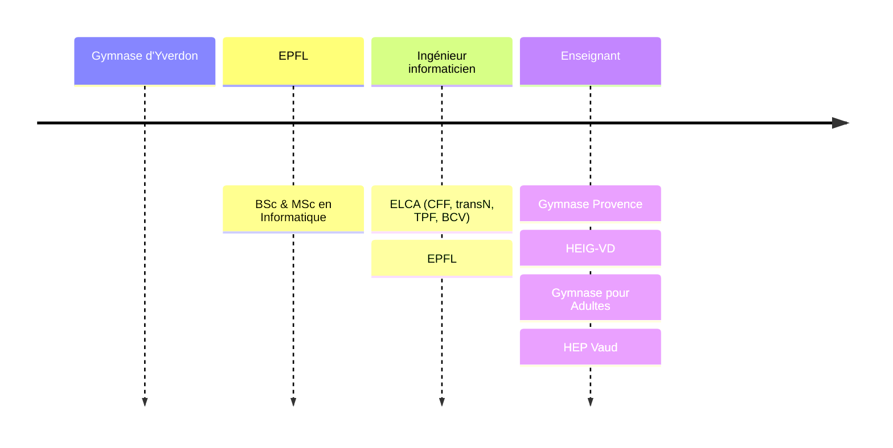

# BS21INF5

## Programmation Web et bases de données

David Tang

---

## Parcours

---

## Organisation

- &shy;<!-- .element: class="fragment" --> Cours & Séminaires
  - **Jeudi** &nbsp;&nbsp;&nbsp;de 10h15 à 11h45
  - **Vendredi** de 08h15 à 09h45
- &shy;<!-- .element: class="fragment" --> Évaluations
  - 50% : **Projet** individuel à rendre en décembre
  - 50% : **Examen** écrit en janvier
- &shy;<!-- .element: class="fragment" --> Charge de travail
  - **1** ECTS = ~**2h**/semaine (cours + travail personnel)

---

## Contenu

- &shy;<!-- .element: class="fragment" --> **Environnement** de développement
- &shy;<!-- .element: class="fragment" --> Programmation Web **statique**
- &shy;<!-- .element: class="fragment" --> Programmation Web **dynamique**
- &shy;<!-- .element: class="fragment" --> **Générateur** de site statique
- &shy;<!-- .element: class="fragment" --> Bases de **données**
- &shy;<!-- .element: class="fragment" --> **Architecture** trois tiers

---

## Ressources

- [hep.davidtang.ch](https://hep.davidtang.ch/)
  - &shy;<!-- .element: class="fragment" --> **Supports** de cours
  - &shy;<!-- .element: class="fragment" --> **Exercices**
- [Moodle](https://elearning.hepl.ch/course/view.php?id=1344)
  - &shy;<!-- .element: class="fragment" --> BS21INF5 - Programmation Web et bases de données
  - &shy;<!-- .element: class="fragment" --> **Forum** (questions, réponses, annonces)
  - &shy;<!-- .element: class="fragment" --> **Rendus** de devoirs
