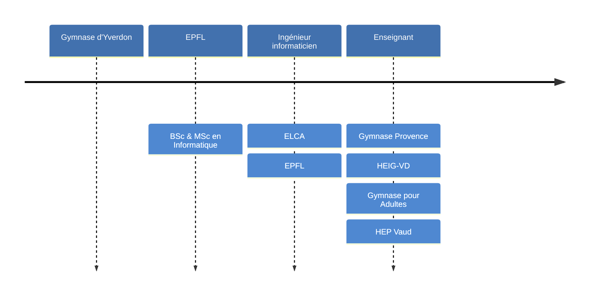

# Programmation Web et bases de données

David Tang

---

## Parcours

---

## Organisation

- &shy;<!-- .element: class="fragment" --> Cours & Laboratoires
  - Jeudi de 10h00 à 11h30
  - Vendredi de 08h15 à 09h45
- &shy;<!-- .element: class="fragment" --> Évaluations
  - 50% : Projet
  - 50% : Examen

---

## Contenu

- &shy;<!-- .element: class="fragment" --> Environnement de développement
- &shy;<!-- .element: class="fragment" --> Programmation Web statique
- &shy;<!-- .element: class="fragment" --> Programmation Web dynamique
- &shy;<!-- .element: class="fragment" --> Backend & API
- &shy;<!-- .element: class="fragment" --> Bases de données

---

## [hep.davidtang.ch](https://hep.davidtang.ch/) <!-- .element: target="_blank" -->
