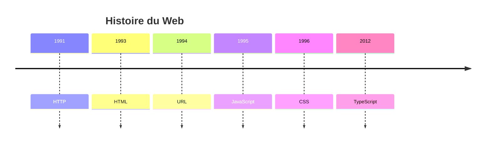

# JavaScript & TypeScript

Programmation Web et bases de données

---



---

## JavaScript

 <!-- .element: class="full" -->

<p class="reference">
  <a href="https://commons.wikimedia.org/wiki/File:Unofficial_JavaScript_logo_2.svg">Christopher Williams</a>, Public domain, via Wikimedia Commons
</p>

---

## JavaScript

- &shy;<!-- .element: class="fragment" --> **Java** + **Script**
  - &shy;<!-- .element: class="fragment" --> Proche de **Java** uniquement au niveau **syntaxique** ! (pas de typage, ni de compilation, ni de JVM)
  - &shy;<!-- .element: class="fragment" --> Popularité de Java à l'époque de la création de JavaScript (**1995**) &rarr; marketing
- &shy;<!-- .element: class="fragment" --> Typage **dynamique** et **faible** (comme Python)
- &shy;<!-- .element: class="fragment" --> **Paradigmes** :
  - &shy;<!-- .element: class="fragment" --> **Script** : interprété, pas de compilation
  - &shy;<!-- .element: class="fragment" --> **Impératif** : instructions séquentielles
  - &shy;<!-- .element: class="fragment" --> **Fonctionnel** : fonctions en tant que valeurs
  - &shy;<!-- .element: class="fragment" --> **Orienté objet** : objets, méthodes, héritage
  - &shy;<!-- .element: class="fragment" --> **Événementiel** : réagir à des événements (clic, clavier, etc.)
- &shy;<!-- .element: class="fragment" --> **Versions** : ES5 (2009), ES6 (2015), ES7 (2016), etc. (ECMAScript)

---

### Commentaires

JavaScript

```javascript
// Commentaire sur une ligne

/* Commentaire
sur plusieurs
lignes */
```

Python

```python
# Commentaire sur une ligne

"""
Commentaire
sur plusieurs
lignes
"""
```

---

### Variables

JavaScript

```javascript
let x = 5;
const y = 10; // Pas réassignable

x = 7;
y = 15; // Erreur
```

Python

```python
x = 5
y = 10
```

---

### Types de données

Similaires à Python

```javascript
const nombre_entier = 5;
const nombre_flottant = 3.14;
const chaine_de_caractere = "Hello"; // string
const booleen = true; // Boolean
const tableau = [1, 2, 3, "bleu", false]; // array
const obj = { name: "Alice", age: 25 }; // object

// Une variable peut aussi être non définie ou nulle
const a = undefined; // jamais déclarée
const b = null;
```

---

### Stdout (sortie standard)

JavaScript

```javascript
console.log("Hello, world!");
```

Python

```python
print("Hello, world!")
```

---

### Blocs de code

JavaScript

```javascript
if (x > 0) {
  console.log("x est positif");
} else {
  console.log("x est négatif ou nul");
}
```

Python

```python
if x > 0:
    print("x est positif")
else:
    print("x est négatif ou nul")
```

---

### Boucles `for`

JavaScript

```javascript
for (let i = 0; i < 5; i++) {
  console.log(i);
}
```

Python

```python
for i in range(5):
    print(i)
```

---

### Fonctions

JavaScript

```javascript
function dire_bonjour(nom) {
  console.log("Bonjour, " + nom + " !");
}
// ou
const dire_bonjour = (nom) => {
  console.log("Bonjour, " + nom + " !");
};

dire_bonjour("Alice");
```

Python

```python
def dire_bonjour(nom):
    print("Bonjour, " + nom + " !")

dire_bonjour("Alice")
```

---

### Objets

```javascript
const personne = {
  nom: "Alice",
  age: 25,
  dire_bonjour: function () {
    console.log("Bonjour, " + this.nom + " !");
  },
  dire_age: () => {
    console.log("J'ai " + this.age + " ans.");
  },
};

personne.dire_bonjour(); // Bonjour, Alice !
personne.dire_age(); // J'ai undefined ans.
// this ne fonctionne pas avec les fonctions fléchées
```

---

### DOM (Document Object Model)


<p class="reference">
  <a href="https://commons.wikimedia.org/wiki/File:DOM-model.svg">‍Birger Eriksson</a>, <a href="https://creativecommons.org/licenses/by-sa/3.0">CC BY-SA 3.0</a>, via Wikimedia Commons
</p>

- &shy;<!-- .element: class="fragment" --> Représentation **arborescente** des éléments HTML
- &shy;<!-- .element: class="fragment" --> **API** (interface) pour **manipuler** le DOM (ajouter, supprimer, modifier des éléments) utilisée par JavaScript
- &shy;<!-- .element: class="fragment" --> **Événements** : réagir à des actions de l'utilisateur (clic, survol, etc.)

---

## TypeScript

 <!-- .element: class="full" -->

<p class="reference">
  <a href="https://commons.wikimedia.org/wiki/File:Typescript.svg">TypeScript</a>, Public domain, via Wikimedia Commons
</p>

---

## TypeScript

 <!-- .element: class="full" -->

https://learntypescript.dev/01/l1-what-is-ts <!-- .element: class="reference" -->

---

## TypeScript

 <!-- .element: class="full" -->

https://jaydevs.com/javascript-vs-typescript/ <!-- .element: class="reference" -->

---

## TypeScript

- &shy;<!-- .element: class="fragment" --> **Sur-ensemble** de JavaScript
- &shy;<!-- .element: class="fragment" --> **Typage statique** (déclarer les types des variables)
- &shy;<!-- .element: class="fragment" --> **Compilation** en JavaScript
