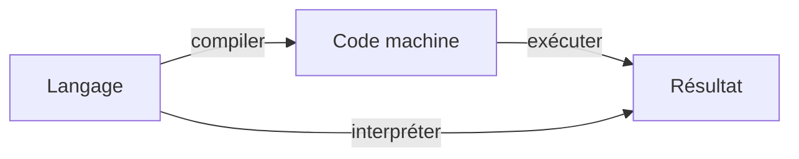

# Générateur de site statique

Programmation Web et bases de données

---

## Site statique

- &shy;<!-- .element: class="fragment" --> Site web (HTML, CSS, JS) dont le contenu est **fixe**
  - &shy;<!-- .element: class="fragment" --> Sans contenu **dynamique** (blog, e-commerce, réseau social, etc.)
  - &shy;<!-- .element: class="fragment" --> Sans **base de données**
- &shy;<!-- .element: class="fragment" --> Avantages :
  - Hébergement moins **cher** et plus **simple**
  - Chargement des pages plus **rapide**
  - Moins de failles de **sécurité** possibles
- &shy;<!-- .element: class="fragment" --> Inconvénients :
  - **Déploiement** pour chaque **modification**
  - &shy;<!-- .element: class="fragment" --> **Similitude** des pages
    - &shy;<!-- .element: class="fragment" --> **DRY** (Don't Repeat Yourself) : philosophie de programmation
    - &shy;<!-- .element: class="fragment" --> Solution : Utiliser des **templates**
      - &shy;<!-- .element: class="fragment" --> **Générer** les pages à partir de **données**

---

## Générateur

 <!-- .element: class="full" -->

https://www.netlify.com/blog/2020/04/14/what-is-a-static-site-generator-and-3-ways-to-find-the-best-one/ <!-- .element: class="reference" -->

---

### Template (Liquid)

```html
<!doctype html>
<html lang="fr">
  <head>
    <meta charset="UTF-8" />
    <title>{{ title }}</title>
  </head>
  <body>
    <header>
      <h1>{{ title }}</h1>
    </header>
    <main>{{ content | markdown }}</main>
  </body>
</html>
```

---

### Données (Markdown)

```markdown
−−−
title: Ma page d'accueil
−−−

# Bienvenue

Ceci est ma page d'accueil.
```

---

### Résultat "compilé"

```html
<!doctype html>
<html lang="fr">
  <head>
    <meta charset="UTF-8" />
    <title>Ma page d'accueil</title>
  </head>
  <body>
    <header>
      <h1>Ma page d'accueil</h1>
    </header>
    <main>
      <h1>Bienvenue</h1>
      <p>Ceci est ma page d'accueil.</p>
    </main>
  </body>
</html>
```

---

## Générateur de site statique

- Static Site Generator (**SSG**)
- &shy;<!-- .element: class="fragment" --> Outil permettant de **générer** des sites statiques
  - &shy;<!-- .element: class="fragment" --> **Templates** (Nunjucks, Liquid, Jinja, etc.)
  - &shy;<!-- .element: class="fragment" --> **Données** (Markdown, JSON, YAML, etc.)
  - &shy;<!-- .element: class="fragment" --> **Compilation** des pages en HTML, CSS et JS
- &shy;<!-- .element: class="fragment" --> Exemples :
  - [Jekyll](https://jekyllrb.com/) (Ruby)
  - [Hugo](https://gohugo.io/) (Go)
  - [11ty](https://www.11ty.dev/) (JavaScript)
  - [Sphinx](https://www.sphinx-doc.org/) (Python)
  - [etc.](https://jamstack.org/generators/)

---

### 11ty

- &shy;<!-- .element: class="fragment" --> SSG en **JavaScript**
- &shy;<!-- .element: class="fragment" --> Comment **exécuter** du JavaScript côté serveur ?
  - **Node.js**
- &shy;<!-- .element: class="fragment" --> Comment **installer** des dépendances JavaScript ?
  - **npm**

---

## Node.js

 <!-- .element: height="128px" -->

https://nodejs.org/fr/about/branding <!-- .element: class="reference" -->

- &shy;<!-- .element: class="fragment" --> **Environnement d'exécution** JavaScript côté serveur (pas dans un navigateur)
  - &shy;<!-- .element: class="fragment" --> **V8** (moteur JavaScript de Google Chrome et Chromium depuis 2008)
  - &shy;<!-- .element: class="fragment" --> **Compile** le code JavaScript en **code machine**
- &shy;<!-- .element: class="fragment" --> Logiciel **libre** géré par la **communauté** OpenJS Foundation

---

### Compiler vs Interpréter

- **Compiler**
  - &shy;<!-- .element: class="fragment" --> Traduire le code source en code machine
  - &shy;<!-- .element: class="fragment" --> **C** ou **C++** en langage machine
  - &shy;<!-- .element: class="fragment" --> **JavaScript** avec **Node.js**
- **Interpréter**
  - &shy;<!-- .element: class="fragment" --> Lire et exécuter le code source ligne par ligne
  - &shy;<!-- .element: class="fragment" --> **Python** dans un terminal
  - &shy;<!-- .element: class="fragment" --> **JavaScript** dans un navigateur



---

## npm

 <!-- .element: height="64px" -->

https://github.com/npm/logos/tree/master <!-- .element: class="reference" -->

- &shy;<!-- .element: class="fragment" --> **Gestionnaire de paquets** pour JavaScript inclus avec **Node.js**
  - &shy;<!-- .element: class="fragment" --> **Installer** des dépendances (bibliothèques, frameworks, etc.)
  - &shy;<!-- .element: class="fragment" --> **Gérer** les versions des dépendances
  - &shy;<!-- .element: class="fragment" --> **Exécuter** des scripts (tests, build, etc.)
- &shy;<!-- .element: class="fragment" --> **Registre** de dépendances sur [npmjs.com](https://www.npmjs.com/)
- &shy;<!-- .element: class="fragment" --> Appartient à **GitHub** depuis 2020 (à **Microsoft** depuis 2018)
- &shy;<!-- .element: class="fragment" --> **package.json** : fichier de configuration
  - &shy;<!-- .element: class="fragment" --> **scripts** : définition des commandes
  - &shy;<!-- .element: class="fragment" --> **dependencies** et **devDependencies** : dépendances du projet
  - &shy;<!-- .element: class="fragment" --> **package-lock.json** : version exacte des dépendances utilisées
- &shy;<!-- .element: class="fragment" --> **node_modules** : répertoire des dépendances

---

### package.json

```json
{
  "name": "mon-projet",
  "version": "1.0.0",
  "description": "Description de mon projet",
  "main": "index.js",
  "scripts": {
    "start": "node index.js",
    "test": "echo \"Error: no test specified\" && exit 1"
  },
  "author": "Moi",
  "license": "GPL-3.0",
  "dependencies": {
    "express": "^4.17.1"
  }
}
```

---

#### Semantic Versioning (semver)

- Numéro de version : **MAJEURE**.**MINEURE**.**PATCH**
  - Exemple : 1.4.2
- &shy;<!-- .element: class="fragment" --> **Majeur** (major) : **1**.0.0
  - **Changements** majeurs (incompatibles avec les versions précédentes)
- &shy;<!-- .element: class="fragment" --> **Mineur** (minor) : 0.**1**.0
  - Nouvelles **fonctionnalités** (rétrocompatibles)
- &shy;<!-- .element: class="fragment" --> **Patch** : 0.0.**1**
  - **Corrections** de bugs (pas de changement fonctionnel)
- &shy;<!-- .element: class="fragment" --> [semver.org](https://semver.org/lang/fr/)

---

### npm CLI

- &shy;<!-- .element: class="fragment" --> **Initialiser** un projet Node.js
  ```bash
  npm init
  ```
- &shy;<!-- .element: class="fragment" --> Installer une **dépendance**
  ```bash
  npm install express
  # ou
  npm i express
  ```
- &shy;<!-- .element: class="fragment" --> Installer une dépendance de **développement**
  ```bash
  npm i -D nodemon
  ```
- &shy;<!-- .element: class="fragment" --> Exécuter le script "**start**"
  ```bash
  npm start
  ```
- &shy;<!-- .element: class="fragment" --> Exécuter un autre **script**
  ```bash
  npm run test
  ```
