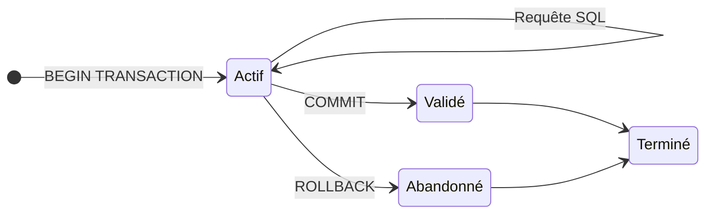

# Transaction & Indexation

Programmation Web et bases de données

---

### Transaction bancaire

- &shy;<!-- .element: class="fragment" --> Table `account` :
  | user | balance |
  | ----- | ------- |
  | Alice | 1000.- |
  | Bob | 500.- |
- &shy;<!-- .element: class="fragment" --> Alice **transfert** 100.- à Bob
- ```sql
  UPDATE account SET balance = balance - 100 WHERE user = 'Alice';
  UPDATE account SET balance = balance + 100 WHERE user = 'Bob';
  ```
  <!-- .element: class="fragment" -->
- ```kroki plantuml half fragment
  @startuml
  Application -> DB : Alice.balance -= 100.-
  Application -> DB : Bob.balance += 100.-
  @enduml
  ```

---

### Transaction bancaire

```kroki plantuml half
@startuml
Application -> DB : Alice.balance -= 100.-
Application ->x DB : Bob.balance += 100.-
@enduml
```

- &shy;<!-- .element: class="fragment" --> Que se passe-t-il si la deuxième requête SQL **échoue** ?
  - Coupure réseau, panne de serveur, SQL invalide, etc.
- &shy;<!-- .element: class="fragment" --> **Incohérence** des données
- &shy;<!-- .element: class="fragment" --> Solution : **transaction**

---

## Transactions

- &shy;<!-- .element: class="fragment" --> **Groupe** de requêtes SQL
- &shy;<!-- .element: class="fragment" --> Propriétés **ACID**
  - &shy;<!-- .element: class="fragment" --> **Atomicité** : toutes les requêtes ou aucune
  - &shy;<!-- .element: class="fragment" --> **Cohérence** : d'une état valide à un autre
  - &shy;<!-- .element: class="fragment" --> **Isolation** : indépendance des transactions en parallèle
  - &shy;<!-- .element: class="fragment" --> **Durabilité** : persistance des changements après la confirmation

---

 <!-- .element: class="full" -->

https://blog.bytebytego.com/p/ep89-what-does-acid-mean <!-- .element: class="reference" -->

---

### TCL (Transaction Control Language)

Sans transaction :

```sql
UPDATE account SET balance = balance - 100 WHERE user = 'Alice';
UPDATE account SET balance = balance + 100 WHERE user = 'Bob';
```

Avec transaction :

```sql
BEGIN TRANSACTION;
UPDATE account SET balance = balance - 100 WHERE user = 'Alice';
UPDATE account SET balance = balance + 100 WHERE user = 'Bob';
COMMIT; -- ou ROLLBACK pour annuler
```

---

### États d'une transaction



---

## Indexation

| id  | name    | age | city     |
| --- | ------- | --- | -------- |
| 1   | Alice   | 25  | Lausanne |
| 2   | Bob     | 30  | Berne    |
| 3   | Charlie | 20  | Genève   |
| 4   | Dave    | 35  | Fribourg |
| 5   | Eve     | 20  | Lausanne |
| 6   | Frank   | 32  | Genève   |
| 7   | Grace   | 22  | Berne    |
| 8   | Harry   | 20  | Lausanne |

- &shy;<!-- .element: class="fragment" --> Les données dans une table sont **ordonnées** (stockage physique)
- &shy;<!-- .element: class="fragment" --> **Complexité** pour la colonne `city` (recherche, tri, etc.) :
  - **Recherche** (`WHERE city = 'Lausanne'`) : <span class="fragment">O(n)</span>
  - **Tri** (`ORDER BY city`) : <span class="fragment">O(n log n)</span>

---

### Données ordonnées

| id  | name    | age | city     |
| --- | ------- | --- | -------- |
| 2   | Bob     | 30  | Berne    |
| 7   | Grace   | 22  | Berne    |
| 4   | Dave    | 35  | Fribourg |
| 3   | Charlie | 20  | Genève   |
| 6   | Frank   | 32  | Genève   |
| 1   | Alice   | 25  | Lausanne |
| 5   | Eve     | 20  | Lausanne |
| 8   | Harry   | 20  | Lausanne |

- &shy;<!-- .element: class="fragment" --> Les lignes sont **ordonnées** par la colonne `city`
- &shy;<!-- .element: class="fragment" --> **Complexité** pour la colonne `city` :
  - **Recherche** (`WHERE city = 'Lausanne'`) : <span class="fragment">O(log n)</span>
  - **Tri** (`ORDER BY city`) : <span class="fragment">O(n) (parcours des lignes)</span>

---

### Complexité

| Opération   | Non ordonné | Ordonné  |
| ----------- | ----------- | -------- |
| Recherche   | O(n)        | O(log n) |
| Tri         | O(n log n)  | O(n)     |
| Ajout       | O(1)        | O(n)     |
| Suppression | O(n)        | O(n)     |

- &shy;<!-- .element: class="fragment" --> L'**ajout** (et la **suppression**) sont plus **coûteux** pour une table ordonnée

---

### Complexité

Pour une table avec 1'000 lignes :

| Opération   | Non ordonné | Ordonné |
| ----------- | ----------- | ------- |
| Recherche   | 1'000       | 10      |
| Tri         | 10'000      | 1'000   |
| Ajout       | 1           | 1'000   |
| Suppression | 1'000       | 1'000   |

---

### Complexité

Pour une table avec 1'000'000 lignes :

| Opération   | Non ordonné | Ordonné   |
| ----------- | ----------- | --------- |
| Recherche   | 1'000'000   | 20        |
| Tri         | 20'000'000  | 1'000'000 |
| Ajout       | 1           | 1'000'000 |
| Suppression | 1'000'000   | 1'000'000 |

---

### Complexité

 <!-- .element: class="full" -->

https://www.sfeir.dev/front/comprendre-la-complexite-des-algorithmes/ <!-- .element: class="reference" -->

---

### Un index

 <!-- .element: class="full" -->

https://zestedesavoir.com/tutoriels/730/administrez-vos-bases-de-donnees-avec-mysql/949_index-jointures-et-sous-requetes/3935_index/ <!-- .element: class="reference" -->

---

### Plusieurs index

 <!-- .element: class="full-width" -->

https://zestedesavoir.com/tutoriels/730/administrez-vos-bases-de-donnees-avec-mysql/949_index-jointures-et-sous-requetes/3935_index/ <!-- .element: class="reference" -->

---

### Table d'index

 <!-- .element: class="full" -->

https://learn.microsoft.com/fr-fr/azure/architecture/patterns/index-table <!-- .element: class="reference" -->

---

### Indexation

- &shy;<!-- .element: class="fragment" --> Créer une **table d'index** selon un certain ordre
- &shy;<!-- .element: class="fragment" --> La table d'index contient les **références** des lignes de la table principale (comme une clé étrangère)
- &shy;<!-- .element: class="fragment" --> Accélère les **recherches** et les **tris** sur la colonne indexée
- &shy;<!-- .element: class="fragment" --> **Coût mémoire** supplémentaire pour stocker la table d'index
- &shy;<!-- .element: class="fragment" --> **Coût de temps** pour l'ajout et la suppression (mise à jour de l'index)
